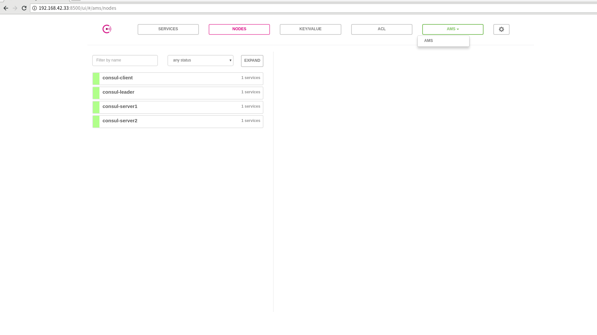

## 环境准备

| 节点名称 |  ip |  角色 |
|-------|----------------|---------|
| ams1  | 192.168.42.33  |  leader |
| ams2  | 192.168.42.198 |  server |
| ams3  | 192.168.42.85  |  server |
| ams4  | 192.168.42.252 |  client |

## 安装并配置

### 安装

分别在4个节点安装

```shell
$ wget https://releases.hashicorp.com/consul/1.0.2/consul_1.0.2_linux_amd64.zip
$ unzip onsul_1.0.2_linux_amd64.zip -d /usr/bin
$ consul version
Consul v1.0.2
Protocol 2 spoken by default, understands 2 to 3 (agent will automatically use protocol >2 when speaking to compatible agents)
```

Consul安装之后，运行Agent。
Agent可以在server或client模式下运行。每个数据中心都必须至少有一个运行于serve，但推荐使用3台或5台服务器。


### 启动leader

#### 创建配置文件

```shell
# cat /etc/consul.d/server.json
{
  "datacenter": "ams",
  "data_dir": "/data/consul",
  "node_name": "consul-leader",
  "server": true,
  "ui": true,
  "bootstrap_expect": 1,
  "client_addr": "0.0.0.0",
  "advertise_addr": "192.168.42.33"
}
```

#### 数据目录

```shell
# mkdir -p /data/consul
# mkdir -p /data/consul/log 
```
#### 启动

```shell
nohup consul agent -config-dir /etc/consul.d > /data/consul/log/server.log 2>&1 &
```

### 启动server1

#### 创建配置文件

```shell
# cat /etc/consul.d/server.json
{
  "datacenter": "ams",
  "data_dir": "/data/consul",
  "node_name": "consul-server1",
  "server": true,
  "ui": true,
  "client_addr": "0.0.0.0",
  "advertise_addr": "192.168.42.198",
  "retry_join": ["192.168.42.33"]
}
```

#### 数据目录

```shell
# mkdir -p /data/consul
# mkdir -p /data/consul/log 
```
#### 启动

```shell
nohup consul agent -config-dir /etc/consul.d > /data/consul/log/server.log 2>&1 &
```

### 启动server2

#### 创建配置文件

```shell
# cat /etc/consul.d/server.json
{
  "datacenter": "ams",
  "data_dir": "/data/consul",
  "node_name": "consul-server2",
  "server": true,
  "ui": true,
  "client_addr": "0.0.0.0",
  "advertise_addr": "192.168.42.85",
  "retry_join": ["192.168.42.33"]
}
```

#### 数据目录

```shell
# mkdir -p /data/consul
# mkdir -p /data/consul/log 
```
#### 启动

```shell
nohup consul agent -config-dir /etc/consul.d > /data/consul/log/server.log 2>&1 &
```

### 启动client

#### 创建配置文件

```shell
# cat /etc/consul.d/server.json
{
  "datacenter": "ams",
  "data_dir": "/data/consul",
  "node_name": "consul-client",
  "server": true,
  "client_addr": "0.0.0.0",
  "advertise_addr": "192.168.42.252",
  "retry_join": ["192.168.42.33"]
}
```

#### 数据目录

```shell
# mkdir -p /data/consul
# mkdir -p /data/consul/log 
```
#### 启动

```shell
nohup consul agent -config-dir /etc/consul.d > /data/consul/log/server.log 2>&1 &
```

## 验证安装

在浏览器中打开[http://192.168.42.33:8500](http://192.168.42.33:8500)


