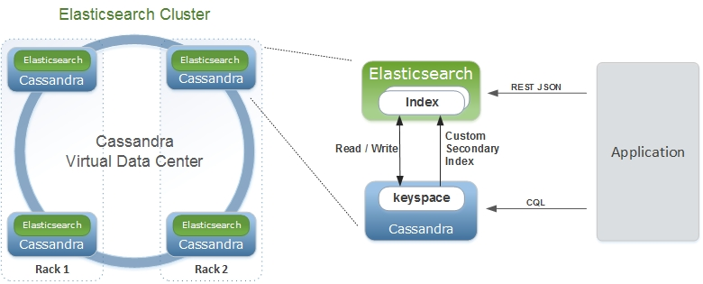

## Elassandra

[Elassandra](http://www.elassandra.io/)是[Elasticsearch](https://github.com/elastic/elasticsearch)的一个分支，经过修改，可以作为[Apache Cassandra](http://cassandra.apache.org/)的插件运行，具有可扩展和灵活的点对点架构。 Elasticsearch代码嵌入在Cassanda节点中，在Cassandra表上提供高级搜索功能，Cassandra用作Elasticsearch数据和配置存储。<!--more-->



Elassandra支持Cassandra vnodes，并通过添加更多节点进行水平扩展。

项目文档可在[doc.elassandra.io](https://doc.elassandra.io)上获得。

## Elassandra的好处

对于Cassandra用户，elassandra提供Elasticsearch功能：

- 在Elasticsearch中更新Cassandra索引。
- 对Cassandra数据进行全文和空间搜索。
- 实时聚合（不需要Spark或Hadoop来完成GROUP BY）
- 在一个查询中提供对多个键空间和表的搜索。
- 使用“用户定义的类型”提供自动模式创建和支持嵌套文档。
- 提供JSON REST API对Cassandra数据的读/写访问。
- 许多Elasticsearch插件和Kibana等产品。
- 管理并发弹性搜索映射更改并应用批处理原子CQL架构更改。
- 支持Elasticsearch摄取处理器，允许转换输入数据。

对于Elasticsearch用户，elassandra提供了有用的功能：

- Elassandra是无主的。群集状态通过cassandra轻量级事务进行管理。
- Elassandra是一个分片的多主数据库，其中Elasticsearch是分片主从。因此，Elassandra没有单点写入，有助于实现高可用性。
- Elassandra继承了Cassandra数据修复机制（暗示切换，读取修复和nodetool修复），为跨数据中心复制提供支持。
- 将节点添加到Elassandra集群时，只有从现有节点提取的数据才会在Elasticsearch中重新编制索引。
- Cassandra可能是您索引和非索引数据的唯一数据存储区。它更易于管理和保护。源文档现在存储在Cassandra中，如果您需要NoSQL数据库和Elasticsearch，则会减少磁盘空间。
- 写操作不限于一个主分片，而是分布在虚拟数据中心的所有Cassandra节点上。分片数量不会限制您的写入吞吐量。添加elassandra节点会增加读写吞吐量。
- Elasticsearch索引可以在许多Cassandra数据中心之间复制，允许写入最近的数据中心并进行全局搜索。
- cassandra驱动程序可识别数据中心和令牌，提供自动负载平衡和故障转移。
- Elassandra有效地将Elasticsearch文档存储在二进制SSTable中，而不会产生任何JSON开销。

## 快速开始

使用docker启动单节点的Elassandra集群：

```bash
# 下载docker镜像
$ docker pull docker.io/strapdata/elassandra:latest
# 启动
$ docker run -d --rm \
  --name elassandra \
  -p 9042:9042 \
  -p 9200:9200 \
  -e JVM_OPTS="-Dcassandra.custom_query_handler_class=org.elassandra.index.ElasticQueryHandler" \
  docker.io/strapdata/elassandra:latest
```
检查Elassandra集群状态：

```bash
$ docker exec -i elassandra nodetool status
  Datacenter: DC1
  ===============
  Status=Up/Down
  |/ State=Normal/Leaving/Joining/Moving
  --  Address     Load       Tokens       Owns (effective)  Host ID                               Rack
  UN  172.17.0.3  80.97 KiB  8            100.0%            81a9e4e0-efe4-458d-861e-8d527835372d  r1
```
### 从Cassandra表创建Elasticsearch索引

使用cassandra CQLSH创建一个cassandra Keyspace，一个User Defined Type，一个Table并添加两行：

```bash
$ docker exec -i elassandra cqlsh <<EOF
CREATE KEYSPACE IF NOT EXISTS test WITH replication = {'class': 'NetworkTopologyStrategy', 'DC1': 1};
CREATE TYPE IF NOT EXISTS test.user_type (first text, last text);
CREATE TABLE IF NOT EXISTS test.docs (uid int, username frozen<user_type>, login text, PRIMARY KEY (uid));
INSERT INTO test.docs (uid, username, login) VALUES (1, {first:'vince',last:'royer'}, 'vroyer');
INSERT INTO test.docs (uid, username, login) VALUES (2, {first:'barthelemy',last:'delemotte'}, 'barth');
EOF
```

通过发现CQL结构从Cassandra表架构创建Elasticsearch索引：

```bash
$ curl -XPUT -H 'Content-Type: application/json' http://localhost:9200/test -d'{"mappings":{"docs":{"discover":".*"}}}'
{"acknowledged":true,"shards_acknowledged":true,"index":"test"}
```

此命令发现与提供的正则表达式匹配的所有列，并创建Eslasticsearch索引。

### 从头开始创建Elasticsearch索引

Elassandra在创建索引或使用新字段更新映射时自动生成基础CQL结构。
```bash
$ curl -XPUT -H 'Content-Type: application/json' http://localhost:9200/test2 -d'{
   "mappings":{
      "docs":{
         "properties": {
            "first": {
               "type":"text"
            },
            "last": {
               "type":"text",
               "cql_collection":"singleton"
            }
         }
      }
   }
}'
{"acknowledged":true,"shards_acknowledged":true,"index":"test2"}
```

生成的CQL结构：
```bash
$ docker exec -it elassandra cqlsh         
  Connected to Test Cluster at 127.0.0.1:9042.
  [cqlsh 5.0.1 | Cassandra 3.11.4.2 | CQL spec 3.4.4 | Native protocol v4]
  Use HELP for help.
  cqlsh> desc KEYSPACE test2;
  
  CREATE KEYSPACE test2 WITH replication = {'class': 'NetworkTopologyStrategy', 'DC1': '1'}  AND durable_writes = true;
  
  CREATE TABLE test2.docs (
      "_id" text PRIMARY KEY,
      first list<text>,
      last text
  ) WITH bloom_filter_fp_chance = 0.01
      AND caching = {'keys': 'ALL', 'rows_per_partition': 'NONE'}
      AND comment = ''
      AND compaction = {'class': 'org.apache.cassandra.db.compaction.SizeTieredCompactionStrategy', 'max_threshold': '32', 'min_threshold': '4'}
      AND compression = {'chunk_length_in_kb': '64', 'class': 'org.apache.cassandra.io.compress.LZ4Compressor'}
      AND crc_check_chance = 1.0
      AND dclocal_read_repair_chance = 0.1
      AND default_time_to_live = 0
      AND gc_grace_seconds = 864000
      AND max_index_interval = 2048
      AND memtable_flush_period_in_ms = 0
      AND min_index_interval = 128
      AND read_repair_chance = 0.0
      AND speculative_retry = '99PERCENTILE';
  CREATE CUSTOM INDEX elastic_docs_idx ON test2.docs () USING 'org.elassandra.index.ExtendedElasticSecondaryIndex'; 
```

### 搜索文档

通过Elasticsearch API搜索文档：

```bash
$ curl "http://localhost:9200/test/_search?pretty"
  {
    "took" : 53,
    "timed_out" : false,
    "_shards" : {
      "total" : 1,
      "successful" : 1,
      "skipped" : 0,
      "failed" : 0
    },
    "hits" : {
      "total" : 2,
      "max_score" : 1.0,
      "hits" : [
        {
          "_index" : "test",
          "_type" : "docs",
          "_id" : "1",
          "_score" : 1.0,
          "_source" : {
            "uid" : 1,
            "login" : "vroyer",
            "username" : {
              "last" : "royer",
              "first" : "vince"
            }
          }
        },
        {
          "_index" : "test",
          "_type" : "docs",
          "_id" : "2",
          "_score" : 1.0,
          "_source" : {
            "uid" : 2,
            "login" : "barth",
            "username" : {
              "last" : "delemotte",
              "first" : "barthelemy"
            }
          }
        }
      ]
    }
  }
```

要通过CQL驱动程序搜索文档，请在表模式中添加以下两个虚拟列。 然后，执行Elasticsearch嵌套查询。 伪列允许您在索引名称与键空间名称不匹配时指定目标索引。

```bash
$ docker exec -it elassandra cqlsh
  Connected to Test Cluster at 127.0.0.1:9042.
  [cqlsh 5.0.1 | Cassandra 3.11.4.2 | CQL spec 3.4.4 | Native protocol v4]
  Use HELP for help.
  cqlsh> ALTER TABLE test.docs ADD es_query text;
  cqlsh> ALTER TABLE test.docs ADD es_options text;
  cqlsh> SELECT uid, login, username FROM test.docs WHERE es_query='{ "query":{"nested":{"path":"username","query":{"term":{"username.first":"barthelemy"}}}}}' AND es_options='indices=test' ALLOW FILTERING;
  
   uid | login | username
  -----+-------+------------------------------------------
     2 | barth | {first: 'barthelemy', last: 'delemotte'}
  
  (1 rows)

```

### 管理Elasticsearch索引

获取Elasticsearch集群状态：
```bash
$ curl "http://localhost:9200/_cluster/state?pretty"
  {
    "cluster_name" : "Test Cluster",
    "compressed_size_in_bytes" : 730,
    "version" : 14,
    "state_uuid" : "tMqNt8PpS5ySuaRxHUGc1w",
    "master_node" : "81a9e4e0-efe4-458d-861e-8d527835372d",
    "blocks" : { },
    "nodes" : {
      "81a9e4e0-efe4-458d-861e-8d527835372d" : {
        "name" : "172.17.0.3",
        "status" : "ALIVE",
        "ephemeral_id" : "81a9e4e0-efe4-458d-861e-8d527835372d",
        "transport_address" : "172.17.0.3:9300",
        "attributes" : {
          "rack" : "r1",
          "dc" : "DC1"
        }
      }
    },
    "metadata" : {
      "version" : 4,
      "cluster_uuid" : "81a9e4e0-efe4-458d-861e-8d527835372d",
      "templates" : { },
      "indices" : {
        "test" : {
          "state" : "open",
          "settings" : {
            "index" : {
              "creation_date" : "1561883488853",
              "number_of_shards" : "1",
              "number_of_replicas" : "0",
              "uuid" : "h34je53mSVqojho2gIH91A",
              "version" : {
                "created" : "6020399"
              },
              "provided_name" : "test"
            }
          },
          "mappings" : {
            "docs" : {
              "properties" : {
                "uid" : {
                  "cql_partition_key" : true,
                  "cql_primary_key_order" : 0,
                  "type" : "integer",
                  "cql_collection" : "singleton"
                },
                "login" : {
                  "type" : "keyword",
                  "cql_collection" : "singleton"
                },
                "username" : {
                  "cql_udt_name" : "user_type",
                  "type" : "nested",
                  "properties" : {
                    "last" : {
                      "type" : "keyword",
                      "cql_collection" : "singleton"
                    },
                    "first" : {
                      "type" : "keyword",
                      "cql_collection" : "singleton"
                    }
                  },
                  "cql_collection" : "singleton"
                }
              }
            }
          },
          "aliases" : [ ],
          "primary_terms" : {
            "0" : 0
          },
          "in_sync_allocations" : {
            "0" : [ ]
          }
        },
        "test2" : {
          "state" : "open",
          "settings" : {
            "index" : {
              "creation_date" : "1561883720880",
              "number_of_shards" : "1",
              "number_of_replicas" : "0",
              "uuid" : "u7BgODwuT_idHbcuenvi6g",
              "version" : {
                "created" : "6020399"
              },
              "provided_name" : "test2"
            }
          },
          "mappings" : {
            "docs" : {
              "properties" : {
                "last" : {
                  "type" : "text",
                  "cql_collection" : "singleton"
                },
                "first" : {
                  "type" : "text"
                }
              }
            }
          },
          "aliases" : [ ],
          "primary_terms" : {
            "0" : 0
          },
          "in_sync_allocations" : {
            "0" : [ ]
          }
        }
      },
      "index-graveyard" : {
        "tombstones" : [ ]
      }
    },
    "routing_table" : {
      "indices" : {
        "test" : {
          "shards" : {
            "0" : [
              {
                "state" : "STARTED",
                "primary" : true,
                "node" : "81a9e4e0-efe4-458d-861e-8d527835372d",
                "relocating_node" : null,
                "shard" : 0,
                "index" : "test",
                "token_ranges" : [
                  "(-9223372036854775808,9223372036854775807]"
                ],
                "allocation_id" : {
                  "id" : "dummy_alloc_id"
                }
              }
            ]
          }
        },
        "test2" : {
          "shards" : {
            "0" : [
              {
                "state" : "STARTED",
                "primary" : true,
                "node" : "81a9e4e0-efe4-458d-861e-8d527835372d",
                "relocating_node" : null,
                "shard" : 0,
                "index" : "test2",
                "token_ranges" : [
                  "(-9223372036854775808,9223372036854775807]"
                ],
                "allocation_id" : {
                  "id" : "dummy_alloc_id"
                }
              }
            ]
          }
        }
      }
    },
    "routing_nodes" : {
      "unassigned" : [ ],
      "nodes" : {
        "81a9e4e0-efe4-458d-861e-8d527835372d" : [
          {
            "state" : "STARTED",
            "primary" : true,
            "node" : "81a9e4e0-efe4-458d-861e-8d527835372d",
            "relocating_node" : null,
            "shard" : 0,
            "index" : "test",
            "token_ranges" : [
              "(-9223372036854775808,9223372036854775807]"
            ],
            "allocation_id" : {
              "id" : "dummy_alloc_id"
            }
          },
          {
            "state" : "STARTED",
            "primary" : true,
            "node" : "81a9e4e0-efe4-458d-861e-8d527835372d",
            "relocating_node" : null,
            "shard" : 0,
            "index" : "test2",
            "token_ranges" : [
              "(-9223372036854775808,9223372036854775807]"
            ],
            "allocation_id" : {
              "id" : "dummy_alloc_id"
            }
          }
        ]
      }
    },
    "snapshots" : {
      "snapshots" : [ ]
    },
    "restore" : {
      "snapshots" : [ ]
    },
    "snapshot_deletions" : {
      "snapshot_deletions" : [ ]
    }
  }
```

获取Elasticsearch索引信息：

```bash
$ curl "http://localhost:9200/_cat/indices?v"
  health status index uuid                   pri rep docs.count docs.deleted store.size pri.store.size
  green  open   test2 u7BgODwuT_idHbcuenvi6g   1   0          0            0       208b           208b
  green  open   test  h34je53mSVqojho2gIH91A   1   0          4            0        4kb            4kb
```

删除Elasticsearch索引（默认情况下不删除底层的Cassandra表）：

```bash
curl -XDELETE http://localhost:9200/test
{"acknowledged":true}
```

