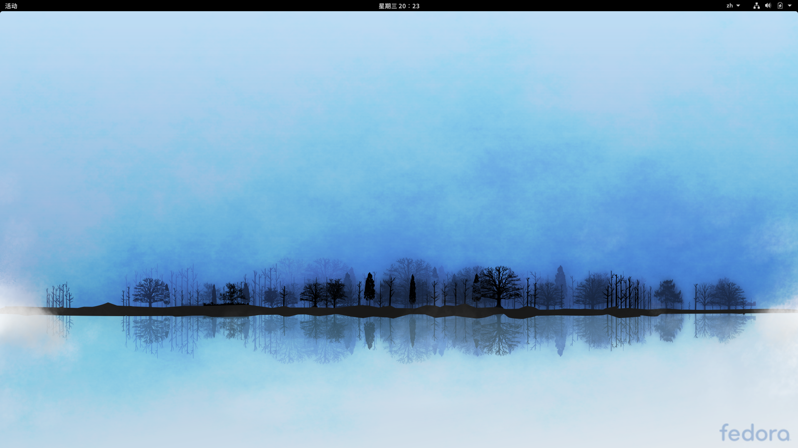
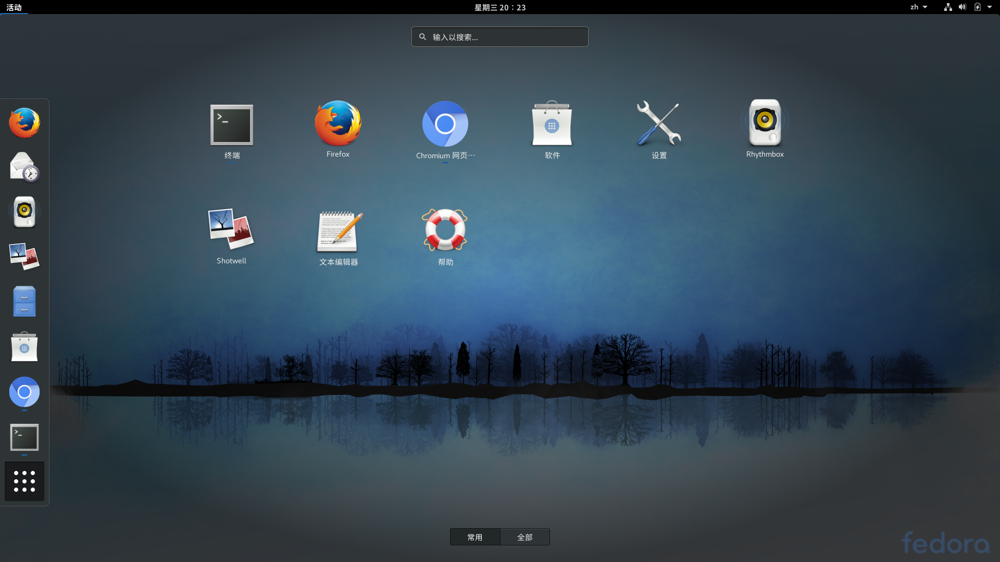
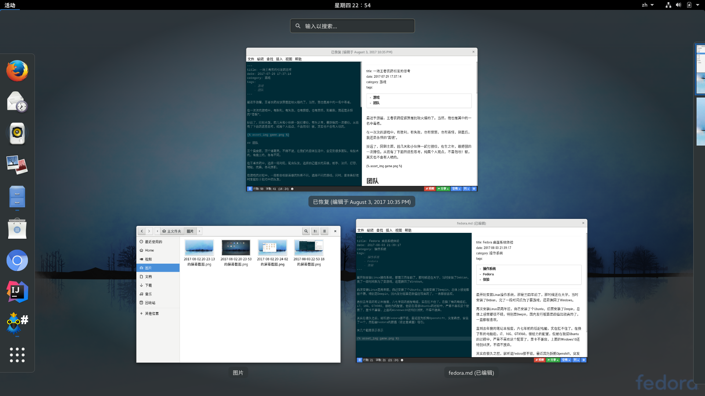
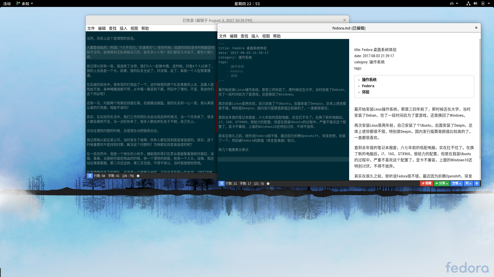
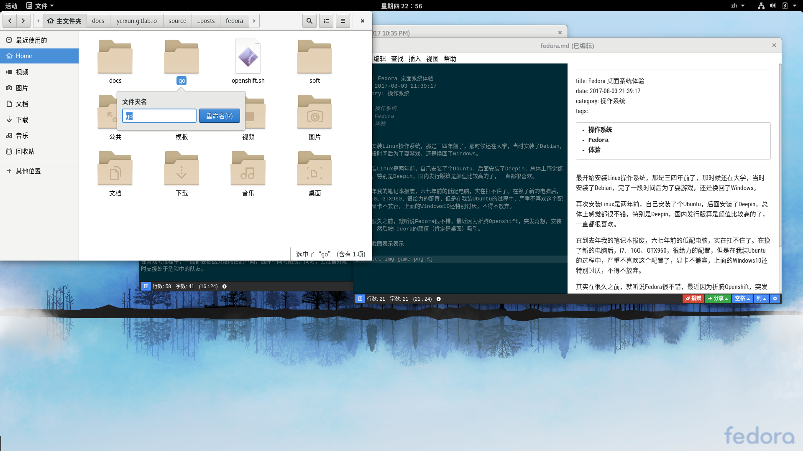
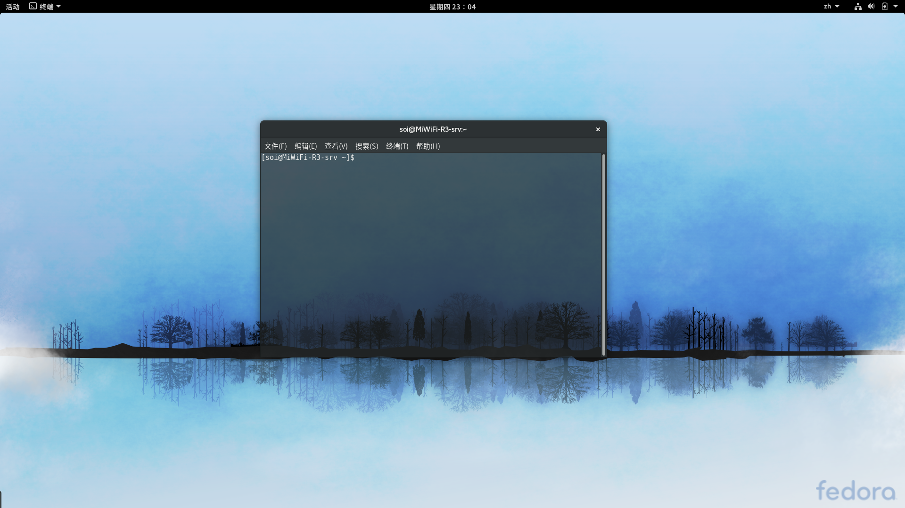

再次安装Linux是两年前，自己安装了个Ubuntu，后面安装了Deepin，总体上感觉都很不错，特别是Deepin，国内发行版算是颜值比较高的了，一直都很喜欢。

直到去年我的笔记本报废，六七年前的低配电脑，实在扛不住了。在换了新的电脑后，i7、16G、GTX960，很给力的配置，但是在我装Ubuntu的过程中，严重不喜欢这个配置了，显卡不兼容，上面的Windows10还特别讨厌，不得不放弃。

其实在很久之前，就听说[Fedora](https://getfedora.org/)很不错，最近因为折腾Openshift，突发奇想，安装了一个，然后被Fedora的颜值（肯定是桌面）吸引。

一张美美的桌面

应用列表

弹出

多窗口

重命名

终端

漂亮不？如果你也喜欢，安装个试试呗！
