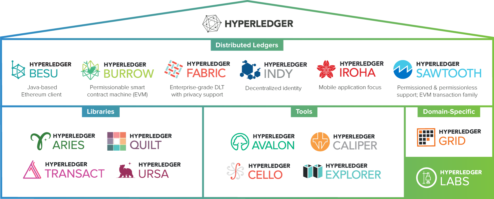
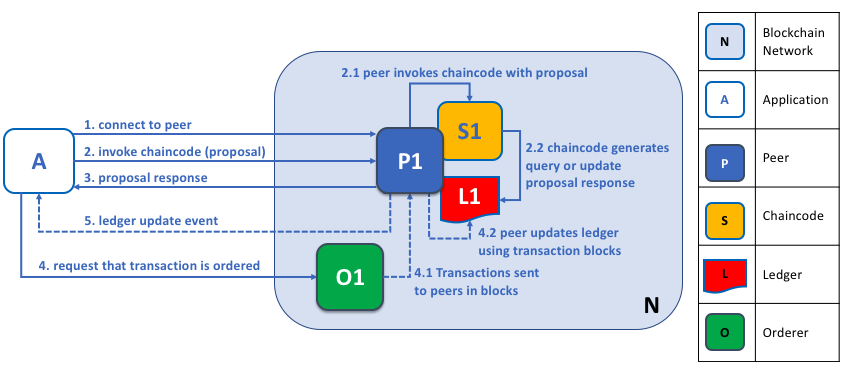

## 什么是区块链？

从纯技术的角度来看，就是将一个个数据区块按照一定的顺序，将其连接起来；从业务现象来看，区块链网络的核心是就是分布式账本，记录了网络上发生的所有交易。

### 区块链的特性

- **区中心化（分散式）** 通常被描述为`去中心化`的，因为每一个参与者都具有相同的账本信息。

- **协作** 每个参与者共同`协作`来维护它，不是单一参与者说了算。

- **不可篡改** 区块链被设计为只可以追加，使用了加密技术来保证一旦将交易添加到账本中，就不能对其进行修改。

## 什么是Hyperledger Fabric？

Linux基金会于2015年创建了Hyperledger项目，以推进跨行业的区块链技术。Hyperledger Fabric是Hyperledger中的区块链项目之一。像其他区块链技术一样，它具有分类帐，使用智能合约，并且是参与者用来管理其交易的系统。Hyperledger Fabric与其他区块链系统最大的不同体现在私有和许可。


Hyperledger Fabric是一个（平台），提供分布式账本解决方案的平台，Hyperledger Fabric由模块化架构支撑，并具备`极佳的保密性`、`可伸缩性`、`灵活性`、`可扩展性`，Hyperledger Fabric被设计成（模块直接插拔，适用多种场景），支持不同的模块组件直接拔插启用，并能适应在经济生态系统中错综复杂的各种场景。


### Hyperledger Fabric的交易流程



> 更多关于Hyperledger Fabric的内容，可以查看[官方文档](https://hyperledger-fabric.readthedocs.io/)以及[官方文档翻译](https://hyperledger-fabric-cn.readthedocs.io/)

## 怎么使用Hyperledger Fabric

> 以下内容基本上是交流时进行的实践步骤中涉及的配置和脚本，如果你想快捷体验，可以[传送](#总结)至后面

### 准备阶段

- Docker
- Docker Swarm
- Hyperledger Fabric镜像

### Hyperledger Fabric镜像

Docker安装，以及Docker Swarm初始化，如果你还不了解，那你可以先自行[多吉](https://www.dogedoge.com/)或者[必应](https://cn.bing.com/)一下。

这里我们需要拉取一下Hyperledger Fabric镜像，由于在2.0之前，Hyperledger Fabric镜像的体积都比较大，拉取比较慢，虽然现在2.0还处于alpha阶段，但是我们搭建一个是开发网络，是没有什么影响的。

```bash
#!/usr/bin/env bash

clear

FABRIC_TAG=2.0

function pullImages() {
  for image in peer orderer ccenv tools ca; do
    echo "Pull image hyperledger/fabric-$image:$FABRIC_TAG"
    docker pull hyperledger/fabric-"$image":"$FABRIC_TAG"
    sleep 1
  done
}

echo "Pull images for hyperledger fabric network."

pullImages
```

### 创建Docker网络

```bash
#!/usr/bin/env bash

clear

DOCKER_NETWORK_NAME=baas
echo "Create docker network $DOCKER_NETWORK_NAME"
docker network create --driver overlay --subnet=10.200.1.0/24 --attachable "$DOCKER_NETWORK_NAME"
```

### 准备Hyperledger Fabric网络配置

- 网络成员加密材料配置

```yaml
# ---------------------------------------------------------------------------
# "OrdererOrgs" - Definition of organizations managing orderer nodes
# ---------------------------------------------------------------------------
OrdererOrgs:
  # ---------------------------------------------------------------------------
  # Orderer
  # ---------------------------------------------------------------------------
  - Name: Orderer
    Domain: cloud-labs.io
    CA:
      Country: CN
      Province: Chongqing
      Locality: Chongqing
    # ---------------------------------------------------------------------------
    # "Specs" - See PeerOrgs below for complete description
    # ---------------------------------------------------------------------------
    Specs:
      - Hostname: orderer0
      - Hostname: orderer1
      - Hostname: orderer2
      - Hostname: orderer3
      - Hostname: orderer4
# ---------------------------------------------------------------------------
# "PeerOrgs" - Definition of organizations managing peer nodes
# ---------------------------------------------------------------------------
PeerOrgs:
  # ---------------------------------------------------------------------------
  # storage org for cloud-labs.io
  # ---------------------------------------------------------------------------
  - Name: storage
    Domain: storage.cloud-labs.io
    EnableNodeOUs: true
    CA:
      Country: CN
      Province: Chongqing
      Locality: Chongqing
    Template:
      Count: 1
    Users:
      Count: 1
  # ---------------------------------------------------------------------------
  # vhost org for cloud-labs.io
  # ---------------------------------------------------------------------------
  - Name: vhost
    Domain: vhost.cloud-labs.io
    EnableNodeOUs: true
    CA:
      Country: CN
      Province: Chongqing
      Locality: Chongqing
    Template:
      Count: 1
    Users:
      Count: 1
```

- 网络初始化以及通道配置

```yaml
---
Organizations:
  - &cloudLabs
    Name: cloudLabs
    ID: cloudLabsMSP
    MSPDir: ./artifacts/crypto-config/ordererOrganizations/cloud-labs.io/msp
    Policies:
      Readers:
        Type: Signature
        Rule: "OR('cloudLabsMSP.member')"
      Writers:
        Type: Signature
        Rule: "OR('cloudLabsMSP.member')"
      Admins:
        Type: Signature
        Rule: "OR('cloudLabsMSP.admin')"

  - &storage
    Name: storage
    ID: storageMSP
    MSPDir: ./artifacts/crypto-config/peerOrganizations/storage.cloud-labs.io/msp
    Policies:
      Readers:
        Type: Signature
        Rule: "OR('storageMSP.admin', 'storageMSP.peer', 'storageMSP.client')"
      Writers:
        Type: Signature
        Rule: "OR('storageMSP.admin', 'storageMSP.client')"
      Admins:
        Type: Signature
        Rule: "OR('storageMSP.admin')"
    AnchorPeers:
      - Host: peer0.storage.cloud-labs.io
        Port: 7051

  - &vhost
    Name: vhost
    ID: vhostMSP
    MSPDir: ./artifacts/crypto-config/peerOrganizations/vhost.cloud-labs.io/msp
    Policies:
      Readers:
        Type: Signature
        Rule: "OR('vhostMSP.admin', 'vhostMSP.peer', 'vhostMSP.client')"
      Writers:
        Type: Signature
        Rule: "OR('vhostMSP.admin', 'vhostMSP.client')"
      Admins:
        Type: Signature
        Rule: "OR('vhostMSP.admin')"
    AnchorPeers:
      - Host: peer0.vhost.cloud-labs.io
        Port: 7051

Capabilities:
  Channel: &ChannelCapabilities
    V1_3: true
  Orderer: &OrdererCapabilities
    V1_1: true
  Application: &ApplicationCapabilities
    V1_3: true
    V1_2: false
    V1_1: false

Application: &ApplicationDefaults
  Organizations:
  Policies:
    Readers:
      Type: ImplicitMeta
      Rule: "ANY Readers"
    Writers:
      Type: ImplicitMeta
      Rule: "ANY Writers"
    Admins:
      Type: ImplicitMeta
      Rule: "MAJORITY Admins"
  Capabilities:
    <<: *ApplicationCapabilities

Orderer: &OrdererDefaults
  OrdererType: etcdraft # solo, kafka
  EtcdRaft:
    Consenters:
      - Host: orderer0.cloud-labs.io
        Port: 7050
        ClientTLSCert: ./artifacts/crypto-config/ordererOrganizations/cloud-labs.io/orderers/orderer0.cloud-labs.io/tls/server.crt
        ServerTLSCert: ./artifacts/crypto-config/ordererOrganizations/cloud-labs.io/orderers/orderer0.cloud-labs.io/tls/server.crt
      - Host: orderer1.cloud-labs.io
        Port: 7050
        ClientTLSCert: ./artifacts/crypto-config/ordererOrganizations/cloud-labs.io/orderers/orderer1.cloud-labs.io/tls/server.crt
        ServerTLSCert: ./artifacts/crypto-config/ordererOrganizations/cloud-labs.io/orderers/orderer1.cloud-labs.io/tls/server.crt
      - Host: orderer2.cloud-labs.io
        Port: 7050
        ClientTLSCert: ./artifacts/crypto-config/ordererOrganizations/cloud-labs.io/orderers/orderer2.cloud-labs.io/tls/server.crt
        ServerTLSCert: ./artifacts/crypto-config/ordererOrganizations/cloud-labs.io/orderers/orderer2.cloud-labs.io/tls/server.crt
      - Host: orderer3.cloud-labs.io
        Port: 7050
        ClientTLSCert: ./artifacts/crypto-config/ordererOrganizations/cloud-labs.io/orderers/orderer3.cloud-labs.io/tls/server.crt
        ServerTLSCert: ./artifacts/crypto-config/ordererOrganizations/cloud-labs.io/orderers/orderer3.cloud-labs.io/tls/server.crt
      - Host: orderer4.cloud-labs.io
        Port: 7050
        ClientTLSCert: ./artifacts/crypto-config/ordererOrganizations/cloud-labs.io/orderers/orderer4.cloud-labs.io/tls/server.crt
        ServerTLSCert: ./artifacts/crypto-config/ordererOrganizations/cloud-labs.io/orderers/orderer4.cloud-labs.io/tls/server.crt
  Addresses:
    - orderer0.cloud-labs.io:7050
    - orderer1.cloud-labs.io:7050
    - orderer2.cloud-labs.io:7050
    - orderer3.cloud-labs.io:7050
    - orderer4.cloud-labs.io:7050
  BatchTimeout: 2s
  BatchSize:
    MaxMessageCount: 10
    AbsoluteMaxBytes: 99 MB
    PreferredMaxBytes: 512 KB

  Organizations:
    - *cloudLabs
  Policies:
    Readers:
      Type: ImplicitMeta
      Rule: "ANY Readers"
    Writers:
      Type: ImplicitMeta
      Rule: "ANY Writers"
    Admins:
      Type: ImplicitMeta
      Rule: "MAJORITY Admins"
    BlockValidation:
      Type: ImplicitMeta
      Rule: "ANY Writers"

Channel: &ChannelDefaults
  Policies:
    # Who may invoke the 'Deliver' API
    Readers:
      Type: ImplicitMeta
      Rule: "ANY Readers"
    # Who may invoke the 'Broadcast' API
    Writers:
      Type: ImplicitMeta
      Rule: "ANY Writers"
    # By default, who may modify elements at this config level
    Admins:
      Type: ImplicitMeta
      Rule: "MAJORITY Admins"
  Capabilities:
    <<: *ChannelCapabilities

Profiles:
  OrdererGenesis:
    <<: *ChannelDefaults
    Capabilities:
      <<: *ChannelCapabilities
    Orderer:
      <<: *OrdererDefaults
      Capabilities:
        <<: *OrdererCapabilities
    Application:
      <<: *ApplicationDefaults
      Organizations:
        - <<: *cloudLabs
    Consortiums:
      SeriesConsortium:
        Organizations:
          - *storage
          - *vhost

  SeriesChannel:
    Consortium: SeriesConsortium
    <<: *ChannelDefaults
    Application:
      <<: *ApplicationDefaults
      Organizations:
        - *storage
        - *vhost
      Capabilities:
        <<: *ApplicationCapabilities
        
    
```

### 生成证书和创世区块

```bash
#!/usr/bin/env bash

clear

FABRIC_TAG=2.0

echo "Generate crypto material"
docker run -it --rm \
  -v "$PWD":/hyperledger-fabric-network \
  -w /hyperledger-fabric-network \
  -e "FABRIC_CFG_PATH=/hyperledger-fabric-network" \
  hyperledger/fabric-tools:$FABRIC_TAG \
  sh -c "rm -rf ./artifacts/crypto-config/* && cryptogen generate --config=./crypto-config.yaml --output=./artifacts/crypto-config"

```

```bash
#!/usr/bin/env bash

clear

FABRIC_TAG=2.0
PROFILE=OrdererGenesis
echo "Generate genesis block for orderer"
docker run -it --rm \
  -v "$PWD":/hyperledger-fabric-network \
  -w /hyperledger-fabric-network \
  -e "FABRIC_CFG_PATH=/hyperledger-fabric-network" \
  hyperledger/fabric-tools:$FABRIC_TAG \
  sh -c "rm -f ./artifacts/config/genesis.block && configtxgen -profile $PROFILE -outputBlock ./artifacts/config/genesis.block -channelID syschain"

```

### 生成Channel交易配置

```bash
#!/usr/bin/env bash

clear

FABRIC_TAG=2.0
PROFILE=SeriesChannel
CHANNEL=alice
echo "Generate channel configuration transaction"
docker run -it --rm \
  -v "$PWD":/hyperledger-fabric-network \
  -w /hyperledger-fabric-network \
  -e "FABRIC_CFG_PATH=/hyperledger-fabric-network" \
  hyperledger/fabric-tools:$FABRIC_TAG \
  sh -c "rm -f ./artifacts/config/$CHANNEL.tx && configtxgen -profile $PROFILE -outputCreateChannelTx ./artifacts/config/$CHANNEL.tx -channelID $CHANNEL"

```

### 配置docker stack编排

- docker-compose-storage.yaml

```yaml
version: '3'
networks:
  baas:
    external:
      name: baas
services:
  ca0:
    image: hyperledger/fabric-ca:2.0
    hostname: ca0.storage.cloud-labs.io
    environment:
      - FABRIC_CA_HOME=/etc/hyperledger/fabric-ca-server
      - FABRIC_CA_SERVER_CA_NAME=ca0.storage.cloud-labs.io
      - FABRIC_CA_SERVER_CA_CERTFILE=/etc/hyperledger/fabric-ca-server-config/ca/ca.storage.cloud-labs.io-cert.pem
      - FABRIC_CA_SERVER_CA_KEYFILE=/etc/hyperledger/fabric-ca-server-config/ca/380edf74737d53b1cc324f1d6c06f8b35bdcbe89799dbdbf146d95da681daec2_sk
      - FABRIC_CA_SERVER_TLS_ENABLED=true
      - FABRIC_CA_SERVER_TLS_CERTFILE=/etc/hyperledger/fabric-ca-server-config/tlsca/tlsca.storage.cloud-labs.io-cert.pem
      - FABRIC_CA_SERVER_TLS_KEYFILE=/etc/hyperledger/fabric-ca-server-config/tlsca/85d708dacaeb88897f6a3744e7cf84a53591049ab692c0ecd9c49a449a4050bf_sk
      - FABRIC_CA_SERVER_PORT=7054
    command: sh -c 'fabric-ca-server start -b admin:adminpw -d'
    ports:
      - 7054
    networks:
      baas:
        aliases:
          - ca0.storage.cloud-labs.io
    volumes:
      - $PWD/artifacts/crypto-config/peerOrganizations/storage.cloud-labs.io/ca/:/etc/hyperledger/fabric-ca-server-config/ca/
      - $PWD/artifacts/crypto-config/peerOrganizations/storage.cloud-labs.io/tlsca/:/etc/hyperledger/fabric-ca-server-config/tlsca/

  peer0:
    image: hyperledger/fabric-peer:2.0
    hostname: peer0.storage.cloud-labs.io
    environment:
      - FABRIC_LOGGING_SPEC=INFO
      - CORE_VM_ENDPOINT=unix:///host/var/run/docker.sock
      - CORE_VM_DOCKER_HOSTCONFIG_NETWORKMODE=baas
      - CORE_PEER_ID=peer0.storage.cloud-labs.io:7051
      - CORE_PEER_LOCALMSPID=storageMSP
      - CORE_PEER_ADDRESS=peer0.storage.cloud-labs.io:7051
      - CORE_PEER_LISTENADDRESS:0.0.0.0:7051
      - CORE_PEER_GOSSIP_USELEADERELECTION=true
      - CORE_PEER_GOSSIP_ORGLEADER=false
      - CORE_PEER_GOSSIP_EXTERNALENDPOINT=peer0.storage.cloud-labs.io:7051
      - CORE_PEER_PROFILE_ENABLED=true
      - CORE_CHAINCODE_EXECUTETIMEOUT=300s
      - CORE_PEER_CHAINCODEADDRESS=peer0.storage.cloud-labs.io:7052
      - CORE_PEER_CHAINCODELISTENADDRESS=0.0.0.0:7052
      - CORE_PEER_TLS_ENABLED=true
      - CORE_PEER_TLS_ROOTCERT_FILE=/etc/hyperledger/fabric/tls/ca.crt
      - CORE_PEER_TLS_CERT_FILE=/etc/hyperledger/fabric/tls/server.crt
      - CORE_PEER_TLS_KEY_FILE=/etc/hyperledger/fabric/tls/server.key
    command: peer node start
    networks:
      baas:
        aliases:
          - peer0.storage.cloud-labs.io
    ports:
      - 7051
      - 7052
      - 7053
    volumes:
      - /var/run/:/host/var/run/
      - $PWD/artifacts/crypto-config/peerOrganizations/storage.cloud-labs.io/peers/peer0.storage.cloud-labs.io/msp:/etc/hyperledger/fabric/msp
      - $PWD/artifacts/crypto-config/peerOrganizations/storage.cloud-labs.io/peers/peer0.storage.cloud-labs.io/tls:/etc/hyperledger/fabric/tls

  cli:
    image: hyperledger/fabric-tools:2.0
    tty: true
    stdin_open: true
    hostname: cli.storage.cloud-labs.io
    environment:
      - GOPATH=/opt/gopath
      - FABRIC_LOGGING_SPEC=INFO
      - CORE_VM_ENDPOINT=unix:///host/var/run/docker.sock
      - CORE_VM_DOCKER_HOSTCONFIG_NETWORKMODE=baas
      - CORE_PEER_ID=peer0.storage.cloud-labs.io:7051
      - CORE_PEER_LOCALMSPID=storageMSP
      - CORE_PEER_ADDRESS=peer0.storage.cloud-labs.io:7051
      - CORE_PEER_MSPCONFIGPATH=/opt/gopath/src/github.com/hyperledger/fabric/peer/crypto/peerOrganizations/storage.cloud-labs.io/users/Admin@storage.cloud-labs.io/msp
      - CORE_PEER_TLS_ENABLED=true
      - CORE_PEER_TLS_CERT_FILE=/opt/gopath/src/github.com/hyperledger/fabric/peer/crypto/peerOrganizations/storage.cloud-labs.io/peers/peer0.storage.cloud-labs.io/tls/server.crt
      - CORE_PEER_TLS_KEY_FILE=/opt/gopath/src/github.com/hyperledger/fabric/peer/crypto/peerOrganizations/storage.cloud-labs.io/peers/peer0.storage.cloud-labs.io/tls/server.key
      - CORE_PEER_TLS_ROOTCERT_FILE=/opt/gopath/src/github.com/hyperledger/fabric/peer/crypto/peerOrganizations/storage.cloud-labs.io/peers/peer0.storage.cloud-labs.io/tls/ca.crt
      - ORDERER_SYSCHAN_ID=syschain
      - ORDERER_CA=/opt/gopath/src/github.com/hyperledger/fabric/orderer/crypto/ordererOrganizations/cloud-labs.io/orderers/orderer0.cloud-labs.io/msp/tlscacerts/tlsca.cloud-labs.io-cert.pem
    working_dir: /opt/gopath/src/github.com/hyperledger/fabric/peer
    command: /bin/bash
    networks:
      - baas
    volumes:
      - /var/run/:/host/var/run/
      - $PWD/artifacts/chaincode:/opt/gopath/src
      - $PWD/artifacts/crypto-config/peerOrganizations:/opt/gopath/src/github.com/hyperledger/fabric/peer/crypto/peerOrganizations
      - $PWD/artifacts/crypto-config/ordererOrganizations:/opt/gopath/src/github.com/hyperledger/fabric/orderer/crypto/ordererOrganizations
      - $PWD/artifacts/config:/opt/gopath/src/github.com/hyperledger/fabric/peer/config
      - $PWD/artifacts/scripts:/opt/gopath/src/github.com/hyperledger/fabric/peer/scripts
```

- docker-compose-vhost.yaml

```yaml
version: '3'
networks:
  baas:
    external:
      name: baas
services:
  ca0:
    image: hyperledger/fabric-ca:2.0
    hostname: ca0.vhost.cloud-labs.io
    environment:
      - FABRIC_CA_HOME=/etc/hyperledger/fabric-ca-server
      - FABRIC_CA_SERVER_CA_NAME=ca0.vhost.cloud-labs.io
      - FABRIC_CA_SERVER_CA_CERTFILE=/etc/hyperledger/fabric-ca-server-config/ca/ca.vhost.cloud-labs.io-cert.pem
      - FABRIC_CA_SERVER_CA_KEYFILE=/etc/hyperledger/fabric-ca-server-config/ca/683dd1cb65ff6a48cb1b1566b380c0b76b2d3d4ce5b79800e5e5a98019c01dce_sk
      - FABRIC_CA_SERVER_TLS_ENABLED=true
      - FABRIC_CA_SERVER_TLS_CERTFILE=/etc/hyperledger/fabric-ca-server-config/tlsca/tlsca.vhost.cloud-labs.io-cert.pem
      - FABRIC_CA_SERVER_TLS_KEYFILE=/etc/hyperledger/fabric-ca-server-config/tlsca/e886c3cec95ad716b823542c342a0514d72a289d05213636d81cbb9071a75bd1_sk
      - FABRIC_CA_SERVER_PORT=7054
    command: sh -c 'fabric-ca-server start -b admin:adminpw -d'
    ports:
      - 7054
    networks:
      baas:
        aliases:
          - ca0.vhost.cloud-labs.io
    volumes:
      - $PWD/artifacts/crypto-config/peerOrganizations/vhost.cloud-labs.io/ca/:/etc/hyperledger/fabric-ca-server-config/ca/
      - $PWD/artifacts/crypto-config/peerOrganizations/vhost.cloud-labs.io/tlsca/:/etc/hyperledger/fabric-ca-server-config/tlsca/

  peer0:
    image: hyperledger/fabric-peer:2.0
    hostname: peer0.vhost.cloud-labs.io
    environment:
      - FABRIC_LOGGING_SPEC=INFO
      - CORE_VM_ENDPOINT=unix:///host/var/run/docker.sock
      - CORE_VM_DOCKER_HOSTCONFIG_NETWORKMODE=baas
      - CORE_PEER_ID=peer0.vhost.cloud-labs.io:7051
      - CORE_PEER_LOCALMSPID=vhostMSP
      - CORE_PEER_ADDRESS=peer0.vhost.cloud-labs.io:7051
      - CORE_PEER_LISTENADDRESS:0.0.0.0:7051
      - CORE_PEER_GOSSIP_USELEADERELECTION=true
      - CORE_PEER_GOSSIP_ORGLEADER=false
      - CORE_PEER_GOSSIP_EXTERNALENDPOINT=peer0.vhost.cloud-labs.io:7051
      - CORE_PEER_PROFILE_ENABLED=true
      - CORE_CHAINCODE_EXECUTETIMEOUT=300s
      - CORE_PEER_CHAINCODEADDRESS=peer0.vhost.cloud-labs.io:7052
      - CORE_PEER_CHAINCODELISTENADDRESS=0.0.0.0:7052
      - CORE_PEER_TLS_ENABLED=true
      - CORE_PEER_TLS_ROOTCERT_FILE=/etc/hyperledger/fabric/tls/ca.crt
      - CORE_PEER_TLS_CERT_FILE=/etc/hyperledger/fabric/tls/server.crt
      - CORE_PEER_TLS_KEY_FILE=/etc/hyperledger/fabric/tls/server.key
    command: peer node start
    networks:
      baas:
        aliases:
          - peer0.vhost.cloud-labs.io
    ports:
      - 7051
      - 7052
      - 7053
    volumes:
      - /var/run/:/host/var/run/
      - $PWD/artifacts/crypto-config/peerOrganizations/vhost.cloud-labs.io/peers/peer0.vhost.cloud-labs.io/msp:/etc/hyperledger/fabric/msp
      - $PWD/artifacts/crypto-config/peerOrganizations/vhost.cloud-labs.io/peers/peer0.vhost.cloud-labs.io/tls:/etc/hyperledger/fabric/tls

  cli:
    image: hyperledger/fabric-tools:2.0
    tty: true
    stdin_open: true
    hostname: cli.vhost.cloud-labs.io
    environment:
      - GOPATH=/opt/gopath
      - FABRIC_LOGGING_SPEC=INFO
      - CORE_VM_ENDPOINT=unix:///host/var/run/docker.sock
      - CORE_VM_DOCKER_HOSTCONFIG_NETWORKMODE=baas
      - CORE_PEER_ID=peer0.vhost.cloud-labs.io:7051
      - CORE_PEER_LOCALMSPID=vhostMSP
      - CORE_PEER_ADDRESS=peer0.vhost.cloud-labs.io:7051
      - CORE_PEER_MSPCONFIGPATH=/opt/gopath/src/github.com/hyperledger/fabric/peer/crypto/peerOrganizations/vhost.cloud-labs.io/users/Admin@vhost.cloud-labs.io/msp
      - CORE_PEER_TLS_ENABLED=true
      - CORE_PEER_TLS_CERT_FILE=/opt/gopath/src/github.com/hyperledger/fabric/peer/crypto/peerOrganizations/vhost.cloud-labs.io/peers/peer0.vhost.cloud-labs.io/tls/server.crt
      - CORE_PEER_TLS_KEY_FILE=/opt/gopath/src/github.com/hyperledger/fabric/peer/crypto/peerOrganizations/vhost.cloud-labs.io/peers/peer0.vhost.cloud-labs.io/tls/server.key
      - CORE_PEER_TLS_ROOTCERT_FILE=/opt/gopath/src/github.com/hyperledger/fabric/peer/crypto/peerOrganizations/vhost.cloud-labs.io/peers/peer0.vhost.cloud-labs.io/tls/ca.crt
      - ORDERER_SYSCHAN_ID=syschain
      - ORDERER_CA=/opt/gopath/src/github.com/hyperledger/fabric/orderer/crypto/ordererOrganizations/cloud-labs.io/orderers/orderer0.cloud-labs.io/msp/tlscacerts/tlsca.cloud-labs.io-cert.pem
    working_dir: /opt/gopath/src/github.com/hyperledger/fabric/peer
    command: /bin/bash
    networks:
      - baas
    volumes:
      - /var/run/:/host/var/run/
      - $PWD/artifacts/chaincode:/opt/gopath/src
      - $PWD/artifacts/crypto-config/peerOrganizations:/opt/gopath/src/github.com/hyperledger/fabric/peer/crypto/peerOrganizations
      - $PWD/artifacts/crypto-config/ordererOrganizations:/opt/gopath/src/github.com/hyperledger/fabric/orderer/crypto/ordererOrganizations
      - $PWD/artifacts/config:/opt/gopath/src/github.com/hyperledger/fabric/peer/config
      - $PWD/artifacts/scripts:/opt/gopath/src/github.com/hyperledger/fabric/peer/scripts
```

- docker-compose-orderer.yaml

```yaml
version: '3'
networks:
  baas:
    external:
      name: baas
services:
  orderer0:
    image: hyperledger/fabric-orderer:2.0
    hostname: orderer0.cloud-labs.io
    environment:
      - FABRIC_LOGGING_SPEC=INFO
      - ORDERER_GENERAL_LISTENADDRESS=0.0.0.0
      - ORDERER_GENERAL_GENESISMETHOD=file
      - ORDERER_GENERAL_GENESISFILE=/var/hyperledger/orderer/orderer.genesis.block
      - ORDERER_GENERAL_LOCALMSPID=cloudLabsMSP
      - ORDERER_GENERAL_LOCALMSPDIR=/var/hyperledger/orderer/msp
      # enabled TLS
      - ORDERER_GENERAL_TLS_ENABLED=true
      - ORDERER_GENERAL_TLS_PRIVATEKEY=/var/hyperledger/orderer/tls/server.key
      - ORDERER_GENERAL_TLS_CERTIFICATE=/var/hyperledger/orderer/tls/server.crt
      - ORDERER_GENERAL_TLS_ROOTCAS=[/var/hyperledger/orderer/tls/ca.crt]
      - ORDERER_GENERAL_CLUSTER_CLIENTCERTIFICATE=/var/hyperledger/orderer/tls/server.crt
      - ORDERER_GENERAL_CLUSTER_CLIENTPRIVATEKEY=/var/hyperledger/orderer/tls/server.key
      - ORDERER_GENERAL_CLUSTER_ROOTCAS=[/var/hyperledger/orderer/tls/ca.crt]
    working_dir: /opt/gopath/src/github.com/hyperledger/fabric
    command: orderer
    networks:
      baas:
        aliases:
          - orderer0.cloud-labs.io
    ports:
      - 7050
    volumes:
      - $PWD/artifacts/crypto-config/ordererOrganizations/cloud-labs.io/users:/var/hyperledger/users
      - $PWD/artifacts/config/genesis.block:/var/hyperledger/orderer/orderer.genesis.block
      - $PWD/artifacts/crypto-config/ordererOrganizations/cloud-labs.io/orderers/orderer0.cloud-labs.io/msp:/var/hyperledger/orderer/msp
      - $PWD/artifacts/crypto-config/ordererOrganizations/cloud-labs.io/orderers/orderer0.cloud-labs.io/tls/:/var/hyperledger/orderer/tls

  orderer1:
    image: hyperledger/fabric-orderer:2.0
    hostname: orderer1.cloud-labs.io
    environment:
      - FABRIC_LOGGING_SPEC=INFO
      - ORDERER_GENERAL_LISTENADDRESS=0.0.0.0
      - ORDERER_GENERAL_GENESISMETHOD=file
      - ORDERER_GENERAL_GENESISFILE=/var/hyperledger/orderer/orderer.genesis.block
      - ORDERER_GENERAL_LOCALMSPID=cloudLabsMSP
      - ORDERER_GENERAL_LOCALMSPDIR=/var/hyperledger/orderer/msp
      # enabled TLS
      - ORDERER_GENERAL_TLS_ENABLED=true
      - ORDERER_GENERAL_TLS_PRIVATEKEY=/var/hyperledger/orderer/tls/server.key
      - ORDERER_GENERAL_TLS_CERTIFICATE=/var/hyperledger/orderer/tls/server.crt
      - ORDERER_GENERAL_TLS_ROOTCAS=[/var/hyperledger/orderer/tls/ca.crt]
      - ORDERER_GENERAL_CLUSTER_CLIENTCERTIFICATE=/var/hyperledger/orderer/tls/server.crt
      - ORDERER_GENERAL_CLUSTER_CLIENTPRIVATEKEY=/var/hyperledger/orderer/tls/server.key
      - ORDERER_GENERAL_CLUSTER_ROOTCAS=[/var/hyperledger/orderer/tls/ca.crt]
    working_dir: /opt/gopath/src/github.com/hyperledger/fabric
    command: orderer
    networks:
      baas:
        aliases:
          - orderer1.cloud-labs.io
    ports:
      - 7050
    volumes:
      - $PWD/artifacts/config/genesis.block:/var/hyperledger/orderer/orderer.genesis.block
      - $PWD/artifacts/crypto-config/ordererOrganizations/cloud-labs.io/orderers/orderer1.cloud-labs.io/msp:/var/hyperledger/orderer/msp
      - $PWD/artifacts/crypto-config/ordererOrganizations/cloud-labs.io/orderers/orderer1.cloud-labs.io/tls/:/var/hyperledger/orderer/tls

  orderer2:
    image: hyperledger/fabric-orderer:2.0
    hostname: orderer2.cloud-labs.io
    environment:
      - FABRIC_LOGGING_SPEC=INFO
      - ORDERER_GENERAL_LISTENADDRESS=0.0.0.0
      - ORDERER_GENERAL_GENESISMETHOD=file
      - ORDERER_GENERAL_GENESISFILE=/var/hyperledger/orderer/orderer.genesis.block
      - ORDERER_GENERAL_LOCALMSPID=cloudLabsMSP
      - ORDERER_GENERAL_LOCALMSPDIR=/var/hyperledger/orderer/msp
      # enabled TLS
      - ORDERER_GENERAL_TLS_ENABLED=true
      - ORDERER_GENERAL_TLS_PRIVATEKEY=/var/hyperledger/orderer/tls/server.key
      - ORDERER_GENERAL_TLS_CERTIFICATE=/var/hyperledger/orderer/tls/server.crt
      - ORDERER_GENERAL_TLS_ROOTCAS=[/var/hyperledger/orderer/tls/ca.crt]
      - ORDERER_GENERAL_CLUSTER_CLIENTCERTIFICATE=/var/hyperledger/orderer/tls/server.crt
      - ORDERER_GENERAL_CLUSTER_CLIENTPRIVATEKEY=/var/hyperledger/orderer/tls/server.key
      - ORDERER_GENERAL_CLUSTER_ROOTCAS=[/var/hyperledger/orderer/tls/ca.crt]
    working_dir: /opt/gopath/src/github.com/hyperledger/fabric
    command: orderer
    networks:
      baas:
        aliases:
          - orderer2.cloud-labs.io
    ports:
      - 7050
    volumes:
      - $PWD/artifacts/config/genesis.block:/var/hyperledger/orderer/orderer.genesis.block
      - $PWD/artifacts/crypto-config/ordererOrganizations/cloud-labs.io/orderers/orderer2.cloud-labs.io/msp:/var/hyperledger/orderer/msp
      - $PWD/artifacts/crypto-config/ordererOrganizations/cloud-labs.io/orderers/orderer2.cloud-labs.io/tls/:/var/hyperledger/orderer/tls

  orderer3:
    image: hyperledger/fabric-orderer:2.0
    hostname: orderer3.cloud-labs.io
    environment:
      - FABRIC_LOGGING_SPEC=INFO
      - ORDERER_GENERAL_LISTENADDRESS=0.0.0.0
      - ORDERER_GENERAL_GENESISMETHOD=file
      - ORDERER_GENERAL_GENESISFILE=/var/hyperledger/orderer/orderer.genesis.block
      - ORDERER_GENERAL_LOCALMSPID=cloudLabsMSP
      - ORDERER_GENERAL_LOCALMSPDIR=/var/hyperledger/orderer/msp
      # enabled TLS
      - ORDERER_GENERAL_TLS_ENABLED=true
      - ORDERER_GENERAL_TLS_PRIVATEKEY=/var/hyperledger/orderer/tls/server.key
      - ORDERER_GENERAL_TLS_CERTIFICATE=/var/hyperledger/orderer/tls/server.crt
      - ORDERER_GENERAL_TLS_ROOTCAS=[/var/hyperledger/orderer/tls/ca.crt]
      - ORDERER_GENERAL_CLUSTER_CLIENTCERTIFICATE=/var/hyperledger/orderer/tls/server.crt
      - ORDERER_GENERAL_CLUSTER_CLIENTPRIVATEKEY=/var/hyperledger/orderer/tls/server.key
      - ORDERER_GENERAL_CLUSTER_ROOTCAS=[/var/hyperledger/orderer/tls/ca.crt]
    working_dir: /opt/gopath/src/github.com/hyperledger/fabric
    command: orderer
    networks:
      baas:
        aliases:
          - orderer3.cloud-labs.io
    ports:
      - 7050
    volumes:
      - $PWD/artifacts/config/genesis.block:/var/hyperledger/orderer/orderer.genesis.block
      - $PWD/artifacts/crypto-config/ordererOrganizations/cloud-labs.io/orderers/orderer3.cloud-labs.io/msp:/var/hyperledger/orderer/msp
      - $PWD/artifacts/crypto-config/ordererOrganizations/cloud-labs.io/orderers/orderer3.cloud-labs.io/tls/:/var/hyperledger/orderer/tls
  orderer4:
    image: hyperledger/fabric-orderer:2.0
    hostname: orderer4.cloud-labs.io
    environment:
      - FABRIC_LOGGING_SPEC=INFO
      - ORDERER_GENERAL_LISTENADDRESS=0.0.0.0
      - ORDERER_GENERAL_GENESISMETHOD=file
      - ORDERER_GENERAL_GENESISFILE=/var/hyperledger/orderer/orderer.genesis.block
      - ORDERER_GENERAL_LOCALMSPID=cloudLabsMSP
      - ORDERER_GENERAL_LOCALMSPDIR=/var/hyperledger/orderer/msp
      # enabled TLS
      - ORDERER_GENERAL_TLS_ENABLED=true
      - ORDERER_GENERAL_TLS_PRIVATEKEY=/var/hyperledger/orderer/tls/server.key
      - ORDERER_GENERAL_TLS_CERTIFICATE=/var/hyperledger/orderer/tls/server.crt
      - ORDERER_GENERAL_TLS_ROOTCAS=[/var/hyperledger/orderer/tls/ca.crt]
      - ORDERER_GENERAL_CLUSTER_CLIENTCERTIFICATE=/var/hyperledger/orderer/tls/server.crt
      - ORDERER_GENERAL_CLUSTER_CLIENTPRIVATEKEY=/var/hyperledger/orderer/tls/server.key
      - ORDERER_GENERAL_CLUSTER_ROOTCAS=[/var/hyperledger/orderer/tls/ca.crt]
    working_dir: /opt/gopath/src/github.com/hyperledger/fabric
    command: orderer
    networks:
      baas:
        aliases:
          - orderer4.cloud-labs.io
    ports:
      - 7050
    volumes:
      - $PWD/artifacts/config/genesis.block:/var/hyperledger/orderer/orderer.genesis.block
      - $PWD/artifacts/crypto-config/ordererOrganizations/cloud-labs.io/orderers/orderer4.cloud-labs.io/msp:/var/hyperledger/orderer/msp
      - $PWD/artifacts/crypto-config/ordererOrganizations/cloud-labs.io/orderers/orderer4.cloud-labs.io/tls/:/var/hyperledger/orderer/tls
```

### 部署

```bash
#!/usr/bin/env bash

docker stack deploy -c docker-compose-storage.yaml storage_cloud-labs_io
sleep 1
docker stack deploy -c docker-compose-vhost.yaml vhost_cloud-labs_io
sleep 1
docker stack deploy -c docker-compose-orderer.yaml cloud-labs_io

sleep 2
docker stack ls

```

### 创建Channel并且安装chaincode

```bash
#!/usr/bin/env bash

clear

CLI_NAME=storage_cloud-labs_io_cli
ORDERER=orderer0.cloud-labs.io:7050
CHANNEL=alice
docker exec -it -e "ORDERER=$ORDERER" -e "CHANNEL=$CHANNEL" "$(docker ps -q -f status=running --filter name=$CLI_NAME)" sh -c 'chmod +x ./scripts/channel.tls.sh && ./scripts/channel.tls.sh create'

```

```bash
#!/usr/bin/env bash
clear
CLI_NAMES=(storage_cloud-labs_io_cli vhost_cloud-labs_io_cli)
ORDERER=orderer0.cloud-labs.io:7050
CHANNEL=alice
for cli in "${CLI_NAMES[@]}"; do
  docker exec -it -e "ORDERER=$ORDERER" -e "CHANNEL=$CHANNEL" "$(docker ps -q -f status=running --filter name="$cli")" sh -c 'chmod +x ./scripts/channel.tls.sh && ./scripts/channel.tls.sh join'
done
```

```bash
#!/usr/bin/env bash
clear
CLI_NAMES=(storage_cloud-labs_io_cli vhost_cloud-labs_io_cli)
ORDERER=orderer0.cloud-labs.io:7050
CHANNEL=alice
CC_NAME=c11
CC_VERSION=1.0
CC_PATH=github.com/c11
for cli in "${CLI_NAMES[@]}"; do
  CID=$(docker ps -q -f status=running --filter name="$cli")
  docker exec -it \
    -e "ORDERER=$ORDERER" \
    -e "CHANNEL=$CHANNEL" \
    -e "CC_NAME=$CC_NAME" \
    -e "CC_VERSION=$CC_VERSION" \
    -e "CC_PATH=$CC_PATH" \
    "$CID" sh -c 'chmod +x ./scripts/chaincode.tls.sh && ./scripts/chaincode.tls.sh install && ./scripts/chaincode.tls.sh install_list'
done

```

```bash
#!/usr/bin/env bash

clear

CLI_NAMES=(storage_cloud-labs_io_cli vhost_cloud-labs_io_cli)
ORDERER=orderer0.cloud-labs.io:7050
CHANNEL=alice
CC_NAME=c11
CC_VERSION=1.0
CC_CTR='{"Args":["init","a","100","b","200"]}'
for cli in "${CLI_NAMES[@]}"; do
  CID=$(docker ps -q -f status=running --filter name="$cli")
  docker exec -it \
    -e "ORDERER=$ORDERER" \
    -e "CHANNEL=$CHANNEL" \
    -e "CC_NAME=$CC_NAME" \
    -e "CC_VERSION=$CC_VERSION" \
    -e "CC_CTR=$CC_CTR" \
    "$CID" sh -c 'chmod +x ./scripts/chaincode.tls.sh && ./scripts/chaincode.tls.sh instantiate && ./scripts/chaincode.tls.sh instantiate_list'
done

```


### 测试

```bash
#!/usr/bin/env bash

clear

CLI_NAME=storage_cloud-labs_io_cli
ORDERER=orderer0.cloud-labs.io:7050
CHANNEL=alice
CC_NAME=c11
CC_QUERY_ARG='{"Args":["query","a"]}'

CID=$(docker ps -q -f status=running --filter name="$CLI_NAME")
docker exec -it \
  -e "ORDERER=$ORDERER" \
  -e "CHANNEL=$CHANNEL" \
  -e "CC_NAME=$CC_NAME" \
  -e "CC_QUERY_ARG=$CC_QUERY_ARG" \
  "$CID" sh -c 'chmod +x ./scripts/chaincode.tls.sh && ./scripts/chaincode.tls.sh query'

```

```bash
#!/usr/bin/env bash

CLI_NAME=storage_cloud-labs_io_cli
ORDERER=orderer0.cloud-labs.io:7050
CHANNEL=alice
CC_NAME=c11
CC_INVOKE_ARG='{"Args":["invoke","a","b","10"]}'
CID=$(docker ps -q -f status=running --filter name="$CLI_NAME")
docker exec -it \
  -e "ORDERER=$ORDERER" \
  -e "CHANNEL=$CHANNEL" \
  -e "CC_NAME=$CC_NAME" \
  -e "CC_INVOKE_ARG=$CC_INVOKE_ARG" \
  "$CID" sh -c 'chmod +x ./scripts/chaincode.tls.sh && ./scripts/chaincode.tls.sh invoke'

```


## 总结

通过本次的交流，再次对Hyperledger Fabric进行了下学习，并且对1.4加入的Raft共识有了一次实践。

本次的交流实践，我把它整理了放到我的仓库，感兴趣的可以去了解下！ [传送门](https://github.com/ycrxun/hyperledger-fabric-network)