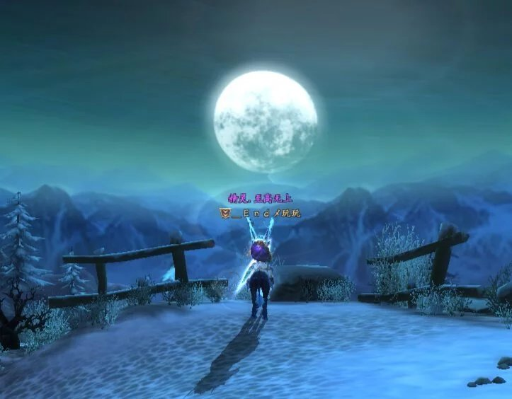
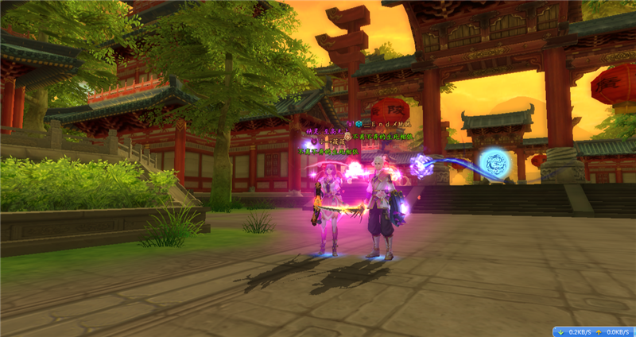
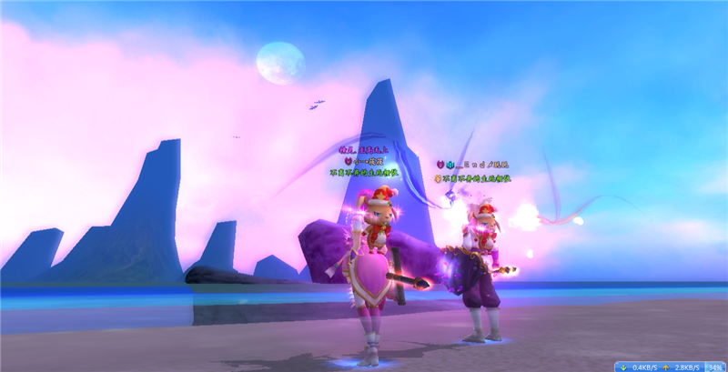
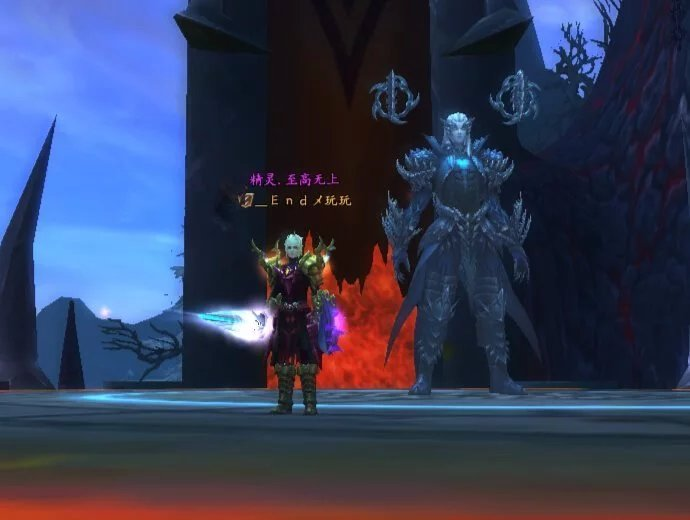
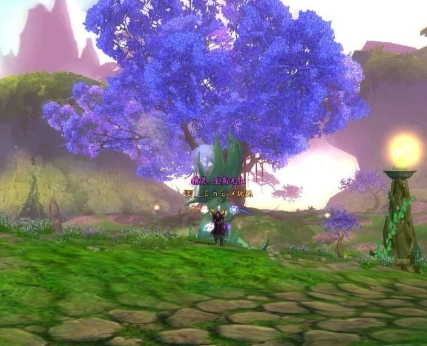
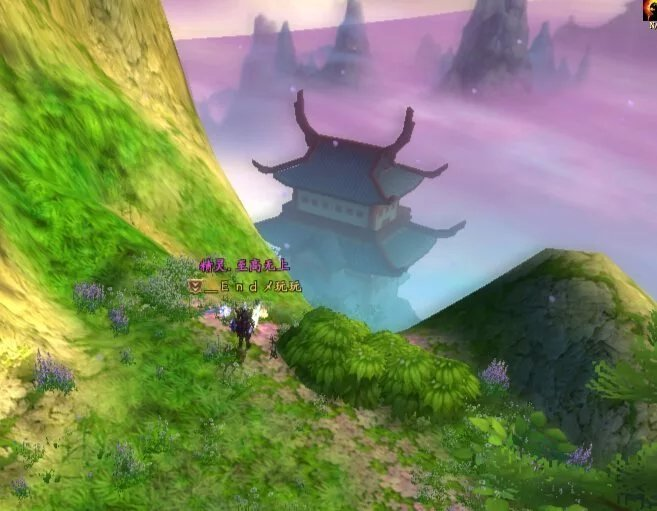
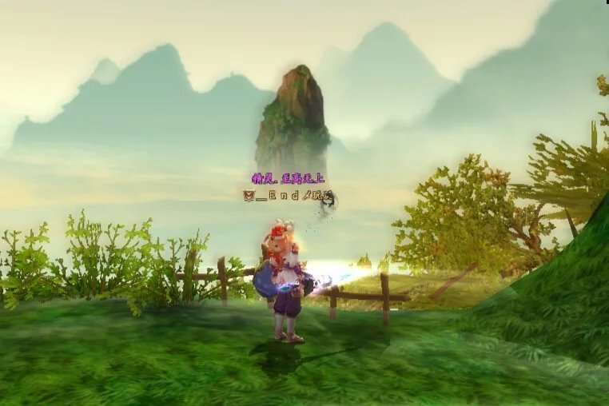
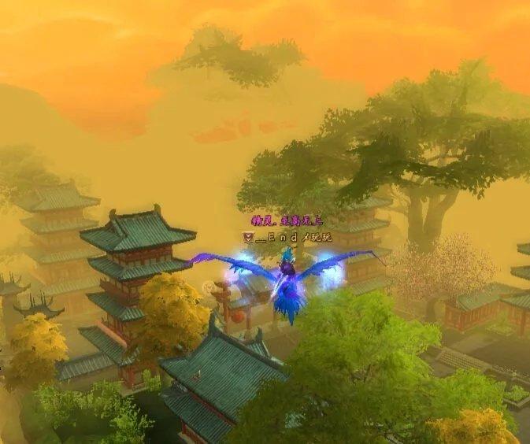

“我来到 你的城市 走过你来时的路 想像着 没我的日子 你是怎样的孤独”---陈奕迅《好久不见》

每次看着这张图，我都会莫名的悲伤。看着这孤独的背影，倍感凄凉。

初识，在那涂炭的血池，魔君肆虐，你我携手共进。

不知为何，我竟如此这般迷恋于你，你的可爱与天真，烂漫了我的世界，甚至使其崩塌。

我向你表达了我的爱慕，你没有拒绝，三生石旁，我许你三生七世，若有负于你，愿永堕阎罗。

我不曾为你准备什么，只是结发，成为夫妻，没有婚礼，没人宾客，你我相拥凝望。

从此江湖，你我相伴，我们去过星界，去过中州，去过西陆，去过雪国，去过沧海、大荒、荧惑岛，在北部雪国是一片冰雪荒芜之地，我们看着雪白的世界，忘却了流离的生活。

仙魔大战，你为了守护我，甘愿与我同为魔族，从此走上黑暗，而我，在不停的战斗中辗转，你只是静静的守候着我，什么都不说，偶尔停下来，我凝望着你的双眸，泛着忧伤。

而如今，我强大到可以独挡一面，你却不知去向。

没有你，我戎马半生，得到天下又能怎么样？

我独自一人，去过我们去过的每一个地方，看我们看过的每一处美景，却只能感受到孤独和忧伤。

或许，我们此生，都不会再见，而我，注定孤独.....

每一天活在思念的池子里，游不出来，又或者不愿意出来.....

如果天黑之前来得及，我要忘了你眼睛，静静等候，余下的七世三生!
