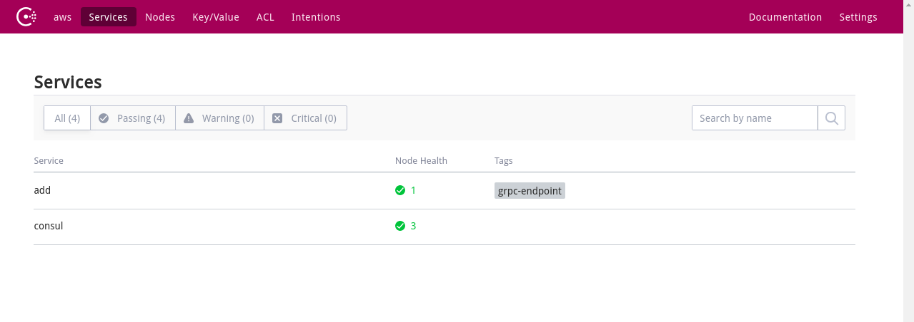

## 前提

- [Consul](https://www.consul.io/)
- Docker
- Golang

## 服务注册

首先，我们来定义服务注册的接口：
```golang
// Registry interface for extend
type Registry interface {
	Register(id string, name string, port int, tags ...string) error
	DeRegister(string) error
}
```

服务注册主要有两个接口，一个用于注册服务的`Register`，一个用于取消注册的`DeRegister`,当我们注册服务的时候，我们需要提供当前服务的ID，名称，端口等信息。

### 注册中心Consul

为了方便我们的服务注册，我则使用[Consul](https://www.consul.io/)作为注册中心，如果你还不知道什么是Consul，你可以看我之前的博客[consul学习一-初见]()以及Consul的官网进行了解。

实现Registry：
```golang
type consul struct {
	client *api.Client
	addr   string
}

// NewConsulRegistry returns a registryClient interface for given consul address
func NewConsulRegistry(c Config) (Registry, error) {
	addr := fmt.Sprintf("%s:%s", c.Host, c.Port)
	if addr == "" {
		addr = "consul:8500"
	}
	cfg := api.DefaultConfig()
	cfg.Address = addr
	cl, err := api.NewClient(cfg)
	if err != nil {
		logrus.Errorf("Can't connect to consul server at %s", addr)
		return nil, err
	}
	return consul{client: cl, addr: addr}, nil
}

func (r consul) Register(id string, name string, port int, tags ...string) error {
	conn, err := net.Dial("udp", "8.8.8.8:80")
	if err != nil {
		return fmt.Errorf("unable to determine local addr: %v", err)
	}
	defer conn.Close()
	localAddr := conn.LocalAddr().(*net.UDPAddr)
	asr := &api.AgentServiceRegistration{
		ID:                name,
		Name:              name,
		Port:              port,
		EnableTagOverride: false,
		Tags:              tags,
		Address:           localAddr.IP.String(),
	}
	err = r.client.Agent().ServiceRegister(asr)
	if err != nil {
		logrus.Errorf("Failed to register service at '%s'. error: %v", r.addr, err)
	} else {
		logrus.Infof("Regsitered service '%s' at consul.", id)
	}
	return err
}

func (r consul) DeRegister(name string) error {
	err := r.client.Agent().ServiceDeregister(name)

	if err != nil {
		logrus.Errorf("Failed to deregister service by id: '%s'. Error: %v", name, err)
	} else {
		logrus.Infof("Deregistered service '%s' at consul.", name)
	}
	return err
}
```

> 完整代码可以查看[gf](https://github.com/ycrxun/gf/tree/master/registry)

## 服务发现

同样，我们定义一个接口：
```golang
// Discovery service
type Discovery interface {
	Dial(name string, opts ...grpc.DialOption) (*grpc.ClientConn, error)
}
```

### 基于Consul发现服务

基于Consul发现服务其实简单，就是使用Consul提供的API，我们去注册中心读取服务的信息（IP，port等）。

```golang
// discovery provider
type discovery struct {
	*api.Client
	dialopts []grpc.DialOption
}

// NewConsulDiscovery returns discovery
func NewConsulDiscovery(cfg Config) (Discovery, error) {
	config := api.DefaultConfig()
	config.Address = fmt.Sprintf("%s:%s", cfg.Host, cfg.Port)
	c, err := api.NewClient(config)
	if err != nil {
		return nil, err
	}

	opts := []grpc.DialOption{
		grpc.WithInsecure(),
		grpc.WithBlock(),
	}

	if cfg.Tracer != nil {
		opts = append(opts, grpc.WithUnaryInterceptor(otgrpc.OpenTracingClientInterceptor(cfg.Tracer)))
		opts = append(opts, grpc.WithStreamInterceptor(otgrpc.OpenTracingStreamClientInterceptor(cfg.Tracer)))
	}

	return discovery{c, opts}, nil
}

// Dial grpc server
func (c discovery) Dial(name string, opts ...grpc.DialOption) (*grpc.ClientConn, error) {
	r, err := lb.NewResolver(c.Client, name, "")

	if err != nil {
		return nil, fmt.Errorf("Create balancer resolver for service %s failed. Error: %v", name, err)
	}
	c.dialopts = append(c.dialopts, grpc.WithBalancer(grpc.RoundRobin(r)))
	c.dialopts = append(c.dialopts, opts...)

	conn, err := grpc.Dial("", c.dialopts...)
	if err != nil {
		return nil, fmt.Errorf("Failed to dial %s: %v", name, err)
	}
	return conn, nil
}

```

> 完整代码可以查看[gf](https://github.com/ycrxun/gf/tree/master/discovery)

## 使用

### 注册与取消注册

根据上篇中，我们只需要在启动gRPC server的时候，把我们的服务注册到Consul即可：
```golang
package cmd

import (
	"github.com/ycrxun/add"
	"github.com/ycrxun/add/server"
	"github.com/ycrxun/gf/registry"

	"github.com/sirupsen/logrus"
	"github.com/spf13/cobra"
	"google.golang.org/grpc"
	"github.com/ycrxun/gf"
)

var serveCmd = &cobra.Command{
	Use:   "serve",
	Short: "Run the RPC server",
	Run: func(cmd *cobra.Command, args []string) {
		logrus.Fatal(runServe())
	},
}

func runServe() error {

	r, err := registry.NewRegistry(registry.Config{
		Provider: registry.Consul,
		Host:     "192.168.31.70",
		Port:     "8500",
	})
	if err != nil {
		return err
	}
	s := gf.NewService("add")

	s.GRPCImplementation(func(g *grpc.Server) {
		add.RegisterAddServiceServer(g, server.AddServer{})
	})

	s.UseRegistry(r)

	s.Run()

	return nil

}

func init() {
	rootCmd.AddCommand(serveCmd)
}

```

### 发现服务

通过上面的代码改造，我们会在服务端启动时把服务注册到Consul，那么在客户端使用时，我们只需要去Consul发现服务即可。

```golang
package cmd

import (
	"context"

	"github.com/kataras/iris"
	"github.com/sirupsen/logrus"
	"github.com/spf13/cobra"
	"github.com/ycrxun/add"
	"github.com/ycrxun/gf/discovery"
)

var clientCmd = &cobra.Command{
	Use:   "client",
	Short: "Run the RPC client",
	Run: func(cmd *cobra.Command, args []string) {
		logrus.Fatal(runClient())
	},
}

func runClient() error {

    // Define discovery
	d, err := discovery.NewDiscovery(discovery.Config{
		Provider: discovery.Consul,
		Host:     "192.168.31.70",
		Port:     "8500",
	})
	if err != nil {
		return err
	}

    // discovery service via name.
	cc, err := d.Dial("add")
	if err != nil {
		return err
	}

	cl := add.NewAddServiceClient(cc)

	app := iris.New()

	app.Get("/:a/:b", func(ctx iris.Context) {
		a, _ := ctx.Params().GetInt64("a")
		b, _ := ctx.Params().GetInt64("b")

		c := context.Background()
		rs, err := cl.Add(c, &add.AddRequest{A: uint64(a), B: uint64(b)})
		if err != nil {
			ctx.Text(err.Error())
			return
		}
		ctx.JSON(rs)
	})
	return app.Run(iris.Addr(":8100"))
}

func init() {
	rootCmd.AddCommand(clientCmd)
}

```

### 启动

编译并依次启动

```bash
$ pwd
/home/soi/golang/src/github.com/ycrxun/add/add

$ go build 

$ ./add serve
INFO[0000] add serve at 0.0.0.0:8000                    
INFO[0000] Regsitered service 'add' at consul.
```
此时，我们打开consul的控制面板，可以看到服务已经注册到上面了


在另一个终端启动client
```bash
$ ./add client
Now listening on: http://localhost:8100
Application started. Press CTRL+C to shut down.
```

打开浏览器，输入`http://localhost:8100/1/1`
```json
{"result":2}
```
