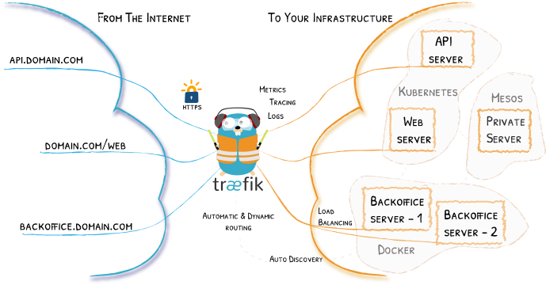

## 目标

开启Traefik的https服务。


## 前期准备

- [Docker](https://www.docker.com/)
- [Traefik](https://traefik.io/)
- [Portainer](https://www.portainer.io/)
- [Docker Compose](https://docs.docker.com/compose/)
- [Docker Swarm](https://docs.docker.com/engine/swarm/)

## Traefik

**Traefik**云原生边缘路由器,反向代理/负载均衡器，简单，动态，自动，快速，功能齐全，开源，经过生产验证，提供指标，并与各种主要集群技术集成......难怪它如此受欢迎！




## 新建stack编排文件

```yaml
version: "3.4"
services:
  server:
    image: traefik:latest
    command:
      - "--api"
      - "--api.dashboard"
      - "--api.statistics"
      - "--entrypoints=Name:http Address::80 Redirect.EntryPoint:https"
      - "--entrypoints=Name:https Address::443 TLS"
      - "--defaultentrypoints=http,https"
      - "--acme"
      - "--acme.storage=/acme.json"
      - "--acme.entryPoint=https"
      - "--acme.httpChallenge.entryPoint=http"
      - "--acme.onHostRule=true"
      - "--acme.onDemand=false"
      - "--acme.email=example@mail.com"
      - "--docker"
      - "--docker.swarmMode"
      - "--docker.domain=example.com"
      - "--docker.watch"
    ports:
      - "80:80"
      - "443:443"
    networks:
      - proxy
    volumes:
      - /var/run/docker.sock:/var/run/docker.sock
    deploy:
      placement:
        constraints:
          - node.role == manager
      update_config:
        parallelism: 1
        delay: 10s
      restart_policy:
        condition: on-failure
      labels:
        - traefik.backend=traefik
        - traefik.frontend.rule=Host:monitor.example.com
        - traefik.docker.network=traefik_proxy
        - traefik.port=8080

networks:
  proxy:

```
> 如上，我们开启了traefik的`api`、`docker`、`docker swarm`、`https`、`自动向Let's Encrypt申请证书`功能，并且把它的`web`功能暴露到`monitor.example.com`，当我们部署完成后，就可以使用`https://monitor.example.com`进行访问。

### 部署traefik

部署其实很简单，为采用的stack模式部署的traefik，命令如下：
```bash
$ ls
traefik.yml

$ sudo docker stack deploy -c traefik.yml traefik

稍等一会儿就可以查看到我们已经完成了traefik的部署，并且使用traefik自动发现Docker上运行的应用时，以及是https了，查看证书详情，可以看到我们的证书使用的Let's Encrypt申请。

