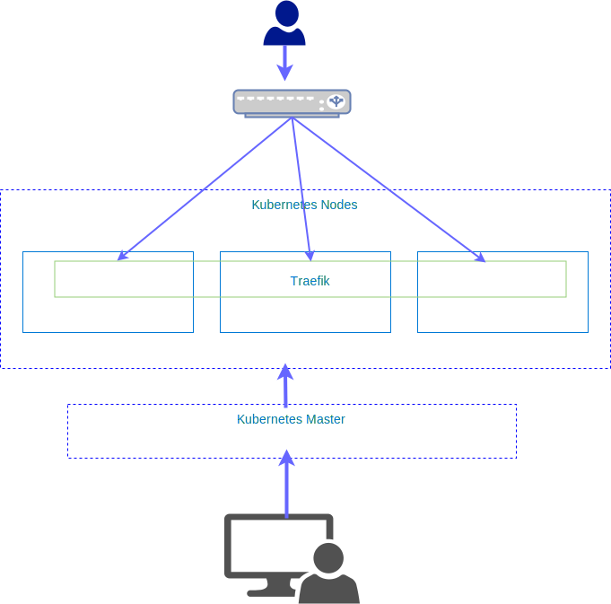
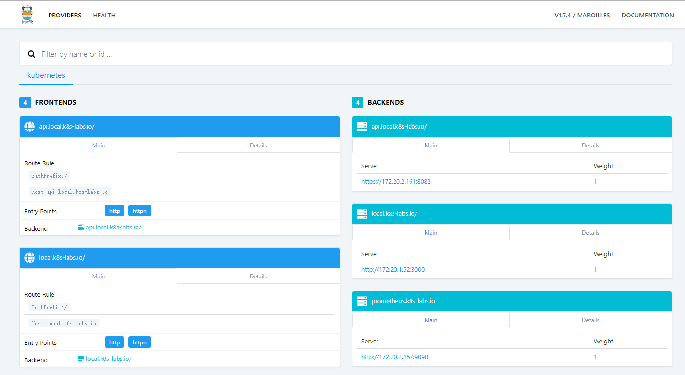
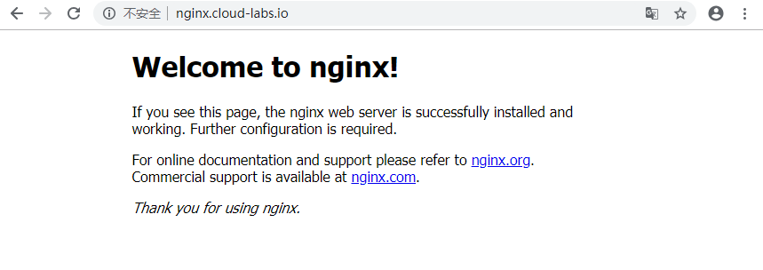

如上图，为称之为部署架构。用户使用域名通过LB访问部署在K8S上的应用，LB通过负载均衡反向代理暴露在NodePort上的Traefik服务，Traefik则在K8S内部使用域名发现K8S上通过Ingress暴露出来的应用。

## 部署Traefik

### [traefik-rbac.yaml](traefik-rbac.yaml)
```yaml
---
apiVersion: v1
kind: ConfigMap
metadata:
  name: traefik
  labels:
    app: traefik
data:
  traefik.toml: |
    # traefik.toml
    logLevel = "INFO"
    defaultEntryPoints = ["http", "httpn"]
    [entryPoints]
      [entryPoints.http]
      address = ":80"
      compress = true
      [entryPoints.httpn]
      address = ":8880"
      compress = true
      [entryPoints.traefik]
      address = ":8080"
    [kubernetes]
    [traefikLog]
      format = "json"
    [api]
      entryPoint = "traefik"
      dashboard = true
---
apiVersion: apps/v1
kind: Deployment
metadata:
  name: traefik
  labels:
    app: traefik
spec:
  replicas: 1
  selector:
    matchLabels:
      app: traefik
      release: traefik
  template:
    metadata:
      annotations:
        checksum/config: 55a29204986001f01835269242a08a68d59bc276658728cc28c5543e34f26d0b
      labels:
        app: traefik
    spec:
      serviceAccountName: traefik
      terminationGracePeriodSeconds: 60
      containers:
      - image: traefik:1.7.4
        name: traefik
        resources:
          requests:
            cpu: "100m"
            memory: "20Mi"
          limits:
            cpu: "100m"
            memory: "30Mi"
        readinessProbe:
          tcpSocket:
            port: 80
          failureThreshold: 1
          initialDelaySeconds: 10
          periodSeconds: 10
          successThreshold: 1
          timeoutSeconds: 2
        livenessProbe:
          tcpSocket:
            port: 80
          failureThreshold: 3
          initialDelaySeconds: 10
          periodSeconds: 10
          successThreshold: 1
          timeoutSeconds: 2
        volumeMounts:
        - mountPath: /config
          name: config
        ports:
        - name: http
          containerPort: 80
          protocol: TCP
        - name: httpn
          containerPort: 8880
          protocol: TCP
        - name: https
          containerPort: 443
          protocol: TCP
        - name: dash
          containerPort: 8080
          protocol: TCP
        args:
        - --configfile=/config/traefik.toml
      volumes:
      - name: config
        configMap:
          name: traefik
---
apiVersion: v1
kind: Service
metadata:
  name: traefik
  labels:
    app: traefik
  annotations:
spec:
  type: NodePort
  selector:
    app: traefik
    release: traefik
  ports:
  - port: 80
    name: http
    targetPort: http
  - port: 443
    name: https
    targetPort: httpn
---
kind: ServiceAccount
apiVersion: v1
metadata:
  name: traefik
---
kind: ClusterRole
apiVersion: rbac.authorization.k8s.io/v1
metadata:
  name: traefik
rules:
  - apiGroups:
      - ""
    resources:
      - pods
      - services
      - endpoints
      - secrets
    verbs:
      - get
      - list
      - watch
  - apiGroups:
      - extensions
    resources:
      - ingresses
    verbs:
      - get
      - list
      - watch
  - apiGroups:
      - extensions
    resources:
      - ingresses/status
    verbs:
      - update
---
kind: ClusterRoleBinding
apiVersion: rbac.authorization.k8s.io/v1
metadata:
  name: traefik
roleRef:
  apiGroup: rbac.authorization.k8s.io
  kind: ClusterRole
  name: traefik
subjects:
- kind: ServiceAccount
  name: traefik
  namespace: kube-system
```

```bash
$ kubectl apply -f traefik-rbac.yaml -n traefik

```

### [traefik-ui.yaml](traefik-ui.yaml)

```yaml
---
apiVersion: extensions/v1beta1
kind: Ingress
metadata:
  name: traefik-dashboard
  labels:
    app: traefik
  annotations:
spec:
  rules:
  - host: traefik.cloud-labs.io
    http:
      paths:
      - backend:
          serviceName: traefik-dashboard
          servicePort: 80
---
apiVersion: v1
kind: Service
metadata:
  name: traefik-dashboard
  labels:
    app: traefik
  annotations:
spec:
  selector:
    app: traefik
    release: traefik
  ports:
  - port: 80
    targetPort: 8080
```

```shell
$ kubectl apply -f traefik-ui.yaml -n traefik
```

## LB

这边将使用nginx作为LB，使用其的反向代理，将请求反向代理到traefik所在的NodePort上，nginx配置[default.conf](defauult.conf)如下：

```conf
upstream k8s  {
    server 192.168.100.100:30080;
    server 192.168.100.101:30080;
    server 192.168.100.102:30080;
}

server {
    listen 80;
    server_name  cloud-labs.io;
 
    #access_log  logs/quancha.access.log  main;
    #error_log  logs/quancha.error.log;
    root   html;
    index  index.html index.htm index.php;
 
    ## send request back to apache ##
    location / {
        proxy_pass  http://k8s;
 
        #Proxy Settings
        proxy_redirect     off;
        proxy_set_header   Host             $host;
        proxy_set_header   X-Real-IP        $remote_addr;
        proxy_set_header   X-Forwarded-For  $proxy_add_x_forwarded_for;
        proxy_next_upstream error timeout invalid_header http_500 http_502 http_503 http_504;
        proxy_max_temp_file_size 0;
        proxy_connect_timeout      90;
        proxy_send_timeout         90;
        proxy_read_timeout         90;
        proxy_buffer_size          4k;
        proxy_buffers              4 32k;
        proxy_busy_buffers_size    64k;
        proxy_temp_file_write_size 64k;
   }
}
```

### 配置hosts

```shell
$ cat /etc/hosts

192.168.100.100 traefik.cloud-labs.io
```

## 验证

打开浏览器，输入`traefik.cloud-labs.io`可以看到如下：


### 部署一个应用

为了简单方便起见，我在这里将部署一个nginx，并使用域名`nginx.cloud-labs.io`来访问它。配置文件[nginx-apps.yaml](nginx-apps.yaml)如下：

```yaml
---
apiVersion: apps/v1
kind: Deployment
metadata:
  name: nginx
  labels:
    app: nginx
    role: web
spec:
  replicas: 1
  selector:
    matchLabels:
      app: nginx
  template:
    metadata:
      labels:
        app: nginx
    spec:
      containers:
      - name: nginx
        image: nginx:latest
        imagePullPolicy: IfNotPresent
        ports:
        - name: http
          containerPort: 80
          protocol: TCP
        - name: https
          containerPort: 443
          protocol: TCP
---
apiVersion: v1
kind: Service
metadata:
  name: nginx
  labels:
    app: nginx
  annotations:
spec:
  type: ClusterIP
  selector:
    app: nginx
  ports:
  - port: 80
    name: http
    targetPort: http
---
apiVersion: extensions/v1beta1
kind: Ingress
metadata:
  name: nginx
  labels:
    app: nginx
  annotations:
spec:
  rules:
  - host: nginx.cloud-labs.io
    http:
      paths:
      - backend:
          serviceName: nginx
          servicePort: 80
```

```shell
$ kubectl apply -f nginx-apps.yaml
$ cat /etc/hosts

192.168.100.100 traefik.cloud-labs.io
192.168.100.100 nginx.cloud-labs.io
```

打开浏览器`http://nginx.cloud-labs.io/`：


## 结束语

一篇水文，到此结束，本文重点记录了在kubernetes上使用traefik作为ingress使用，不为别的，就是为了记录下。
