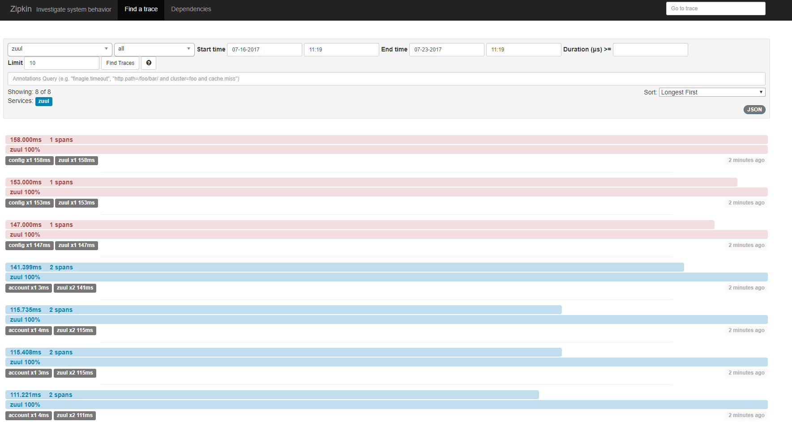
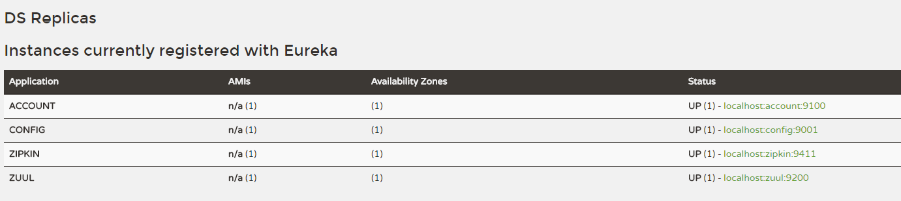
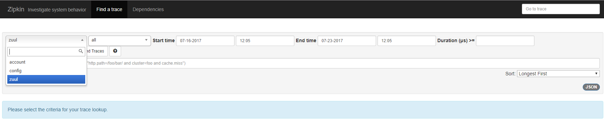
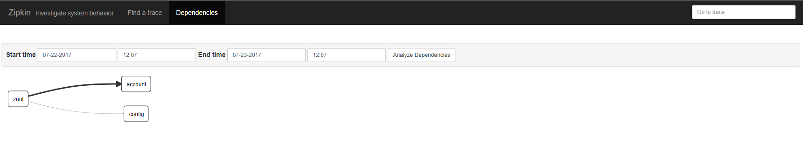
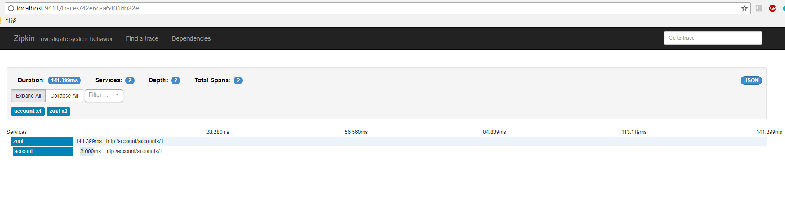

将应用程序用于向Zipkin报告时序数据。 Zipkin UI还提供了一个依赖关系图，显示了每个应用程序中跟踪的请求数量。 如果要解决延迟问题或错误，可以根据应用程序，跟踪长度，注释或时间戳来过滤或排序所有跟踪。 选择跟踪后，您可以看到每个跨度所需的总跟踪时间的百分比，从而允许您识别问题应用程序。




## 快速开始

首先，我是一个spring cloud的初学者，所以我在本次采用了spring cloud来学习zipkin，当然，只要你愿意，你完全可以不采用spring cloud。

项目结构如下：

```shell
- platform
  - account
  - config
  - registry
  - zipkin
  - zuul
  pom.xml
```

这是个多模块项目，其中子模块分别对应的是账号服务、配置中心、注册中心、zipkin服务、API Getaway。

### Zipkin Server
首先，我们来看看zipkin模块的pom.xml

```xml
<?xml version="1.0" encoding="UTF-8"?>
<project xmlns="http://maven.apache.org/POM/4.0.0"
         xmlns:xsi="http://www.w3.org/2001/XMLSchema-instance"
         xsi:schemaLocation="http://maven.apache.org/POM/4.0.0
         http://maven.apache.org/xsd/maven-4.0.0.xsd">
    <parent>
        <artifactId>platform</artifactId>
        <groupId>team.soi</groupId>
        <version>1.0-SNAPSHOT</version>
    </parent>
    <modelVersion>4.0.0</modelVersion>

    <artifactId>zipkin</artifactId>
    <version>1.0-SNAPSHOT</version>

    <dependencies>
        <dependency>
            <groupId>org.springframework.cloud</groupId>
            <artifactId>spring-cloud-starter-config</artifactId>
        </dependency>

        <dependency>
            <groupId>org.springframework.cloud</groupId>
            <artifactId>spring-cloud-starter-eureka</artifactId>
        </dependency>

        <dependency>
            <groupId>org.springframework.boot</groupId>
            <artifactId>spring-boot-starter-actuator</artifactId>
        </dependency>

        <dependency>
            <groupId>io.zipkin.java</groupId>
            <artifactId>zipkin-server</artifactId>
        </dependency>

        <dependency>
            <groupId>io.zipkin.java</groupId>
            <artifactId>zipkin-autoconfigure-ui</artifactId>
        </dependency>

        <dependency>
            <groupId>io.zipkin.java</groupId>
            <artifactId>zipkin-autoconfigure-storage-mysql</artifactId>
        </dependency>

        <dependency>
            <groupId>mysql</groupId>
            <artifactId>mysql-connector-java</artifactId>
        </dependency>

        <dependency>
            <groupId>org.springframework.boot</groupId>
            <artifactId>spring-boot-starter-jdbc</artifactId>
        </dependency>

        <dependency>
            <groupId>org.projectlombok</groupId>
            <artifactId>lombok</artifactId>
        </dependency>

        <dependency>
            <groupId>org.jetbrains.kotlin</groupId>
            <artifactId>kotlin-stdlib</artifactId>
        </dependency>
    </dependencies>

    <build>
        <finalName>zipkin</finalName>
        <plugins>
            <plugin>
                <groupId>org.apache.maven.plugins</groupId>
                <artifactId>maven-compiler-plugin</artifactId>
            </plugin>
            <plugin>
                <artifactId>kotlin-maven-plugin</artifactId>
                <groupId>org.jetbrains.kotlin</groupId>
            </plugin>

            <plugin>
                <groupId>org.springframework.boot</groupId>
                <artifactId>spring-boot-maven-plugin</artifactId>
            </plugin>
        </plugins>
    </build>
</project>
```

从pom.xml中，不难看出，我引入了`zipkin-server`、`zipkin-autoconfigure-ui`、`zipkin-autoconfigure-storage-mysql`，在本例中，我采用的mysql存储。

接下来，我们只需要在启动类中打开`@EnableZipkinServer`注解就OK。

```java
package team.soi.platform.zipkin

import org.springframework.boot.SpringApplication
import org.springframework.boot.autoconfigure.SpringBootApplication
import org.springframework.cloud.client.discovery.EnableDiscoveryClient
import zipkin.server.EnableZipkinServer

/**
 * @author Soi.
 *
 * @version 1.0
 *
 * @see
 */
@SpringBootApplication
@EnableZipkinServer
@EnableDiscoveryClient
open class App

fun main(args: Array<String>) {
    SpringApplication.run(App::class.java, *args)
}
```

zipkin服务的配置文件application.yml如下：

```yaml
server:
  port: ${port:9411}
spring:
  application:
    name: zipkin
  datasource:
      schema: classpath:/mysql.sql
      url: jdbc:mysql://localhost:3306/zipkin?autoReconnect=true
      username: root
      password: root
      driver-class-name: com.mysql.jdbc.Driver
      initialize: true
      continue-on-error: true
eureka:
  client:
    serviceUrl:
      defaultZone: ${defaultZone:http://localhost:8761/eureka/}
```

### Zipkin Client

在使用zipkin服务的模块的pom.xml中加入下面的依赖：

```xml
<dependency>
    <groupId>org.springframework.cloud</groupId>
    <artifactId>spring-cloud-starter-zipkin</artifactId>
</dependency>
```

然后在application.yml中注明zipkin的url：

```yaml
spring:
  zipkin:
      base-url: http://localhost:9411
```

在我的示例中，我分别在config、zuul、account模块中加入了zipkin的配置。

### Zipkin UI

首先，我分别启动了这几个模块，我们可以在Eureka的UI中看到：



然后我分别在浏览器中访问API Getaway中映射的API`http://localhost:9200/account/accounts/1`和`http://localhost:9200/config/platform/zuul/dev`，然后在打开Zipkin页面。



我们可以看到服务调用的依赖关系：



还可以看到调用的详细信息：



## 总结

在spring cloud中，为我们集成了许许多多工具，为我们的微服务开发提供了便利，同时也解决了我们的一些痛点，而Zipkin，为我们解决了服务调用链的追踪问题，同时提供了详细的调用时间，可以是我们更加有效地知晓服务的性能瓶颈在哪些地方。

当然，本例只是简单的介绍了下Zipkin的使用，没有想过会给你带来什么。
